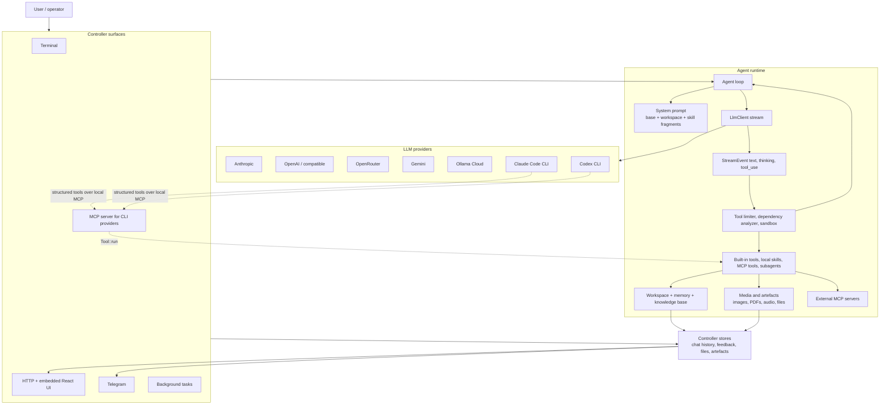

# Dyson

Dyson is a streaming AI agent runtime in Rust. It is built to make the agent
loop understandable: stream model output, detect tool calls, gate those calls
through a sandbox, feed results back to the model, and repeat until the task is
done.

The sibling [`dyson-swarm`](https://github.com/JonCooperWorks/dyson-swarm)
repo is the host-side control plane for running Dyson agents inside Cube
sandboxes. This repo is the agent process itself.

## What It Does

- Streams text and tool events from Anthropic, OpenAI, OpenRouter, Gemini,
  Ollama Cloud, Claude Code, and Codex.
- Executes tools through the `Sandbox` trait before any side effect happens.
- Supports built-in tools, local `SKILL.md` skills, MCP client tools, and
  subagents.
- Persists chats, workspace memory, knowledge-base content, artefacts, and
  feedback through controller stores.
- Serves terminal, HTTP/web, Telegram, background, and MCP-facing controller
  surfaces.
- Runs in a Swarm-owned mode where config, tokens, proxy URLs, and durable
  state are supplied by `dyson-swarm`.

## Architecture



## Request Flow

```text
Controller receives input
  -> Agent::run appends a user message
  -> LlmClient::stream emits StreamEvent values
  -> stream_handler turns text and tool deltas into messages + ToolCall values
  -> Sandbox::check allows, denies, or redirects each tool call
  -> Tool::run executes allowed calls
  -> Sandbox::after can truncate, redact, or audit output
  -> tool_result messages go back to the model
```

Providers such as Claude Code and Codex run their own tool loop internally.
Dyson displays their stream and stops after one provider turn instead of
re-executing tool events.

## Sandbox

Sandboxing is on by default. The default `PolicySandbox` combines application
checks for Rust-native tools with OS-level wrappers for shell commands:

- Linux: `bubblewrap`
- macOS: Apple `container` CLI

The sandbox is a guardrail for mistaken or prompt-injected tool calls, not a
full hostile-code containment story. `--dangerous-no-sandbox` disables those
guardrails and is intended for local development only.

See [Sandbox](docs/sandbox.md).

## CLI

```bash
# one-shot prompt
cargo run -- run --dangerous-no-sandbox "what files are in this directory?"

# start configured controllers
cargo run -- listen --config ./dyson.json

# initialise ~/.dyson
cargo run -- init --noinput

# hash a web-controller bearer token
cargo run -- hash-bearer 'super-secret-token'
```

The `swarm` subcommand is for `dyson-swarm`; it reads `SWARM_*` environment
variables, synthesizes runtime config, and starts the HTTP controller inside a
Cube sandbox.

## Configuration

Dyson uses `dyson.json`. Current configs use `config_version: 3`; older files
are migrated automatically on load.

Minimal config:

```json
{
  "config_version": 3,
  "providers": {
    "claude": {
      "type": "anthropic",
      "models": ["claude-sonnet-4-20250514"],
      "api_key": { "resolver": "insecure_env", "name": "ANTHROPIC_API_KEY" }
    }
  },
  "agent": {
    "provider": "claude"
  },
  "controllers": [
    { "type": "terminal" }
  ]
}
```

Provider entries must include a non-empty `models` array. The first entry is
the active default for that provider. See [Configuration](docs/configuration.md).

## Providers

| Provider | Config value | Credential source | Notes |
|---|---|---|---|
| Anthropic | `anthropic` | `ANTHROPIC_API_KEY` or `api_key` | Native Messages API and tool blocks |
| OpenAI | `openai`, `gpt` | `OPENAI_API_KEY` or `api_key` | Native OpenAI, or compatible APIs via `base_url` |
| OpenRouter | `openrouter` | `OPENROUTER_API_KEY` or `api_key` | OpenAI-compatible wrapper with model dialect handling |
| Gemini | `gemini`, `google` | `GEMINI_API_KEY` or `api_key` | Gemini streaming and image generation support |
| Ollama Cloud | `ollama-cloud`, `ollama` | `OLLAMA_API_KEY` or `api_key` | OpenAI-compatible cloud endpoint |
| Claude Code | `claude-code`, `cc` | Claude CLI auth | Subprocess provider with internal tools |
| Codex | `codex`, `codex-cli` | Codex CLI auth | Subprocess provider with internal tools |

When `base_url` is set for an API-key provider, environment fallback is blocked;
put the intended key in that provider entry explicitly.

## Web UI

The HTTP controller serves an embedded React UI plus JSON and SSE APIs. Use a
loopback bind for local operation:

```json
{
  "type": "http",
  "bind": "127.0.0.1:7878"
}
```

Loopback without auth is treated as a single-operator local workflow. Any
non-loopback bind must declare auth. Bearer auth stores an Argon2id hash, not a
plaintext token:

```json
{
  "auth": {
    "type": "bearer",
    "hash": { "resolver": "insecure_env", "name": "DYSON_WEB_BEARER_HASH" }
  }
}
```

OIDC is also supported, including `allowed_sub` for single-user public
deployments. See [Web UI / HTTP Controller](docs/web.md) before exposing the
controller beyond loopback.

## Image Generation

Set `agent.image_generation_provider` to a configured provider that supports
image generation. Gemini and OpenRouter image providers are supported. The
built-in `image_generate` tool is absent when no image provider is configured.

```json
{
  "providers": {
    "gemini-image": {
      "type": "gemini",
      "models": ["gemini-3-pro-image-preview"],
      "api_key": { "resolver": "insecure_env", "name": "GEMINI_API_KEY" }
    }
  },
  "agent": {
    "provider": "claude",
    "image_generation_provider": "gemini-image"
  }
}
```

In `dyson swarm` mode, `dyson-swarm` normally pushes a dedicated
`openrouter-image` provider and image model through `/api/admin/configure`.

## Documentation

Start with:

- [Architecture Overview](docs/architecture-overview.md)
- [Agent Loop](docs/agent-loop.md)
- [LLM Clients](docs/llm-clients.md)
- [Tools & Skills](docs/tools-and-skills.md)
- [Sandbox](docs/sandbox.md)
- [Configuration](docs/configuration.md)
- [Web UI / HTTP Controller](docs/web.md)
- [Tool Forwarding over MCP](docs/tool-forwarding-over-mcp.md)

The full index is in [docs/README.md](docs/README.md).

## Tests

```bash
cargo test
```

Use focused package or module filters while developing, then run the full suite
before shipping code changes.
