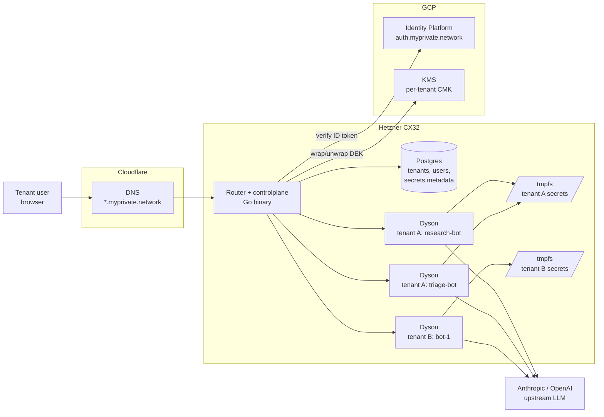
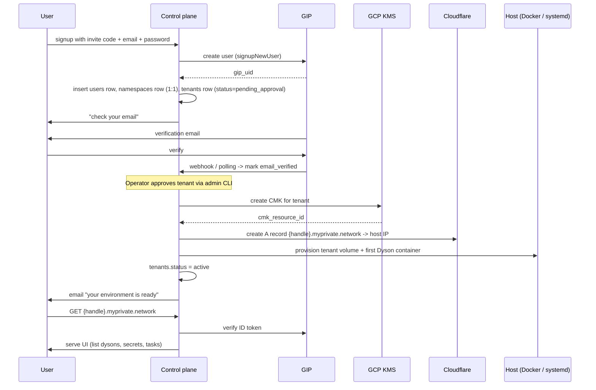
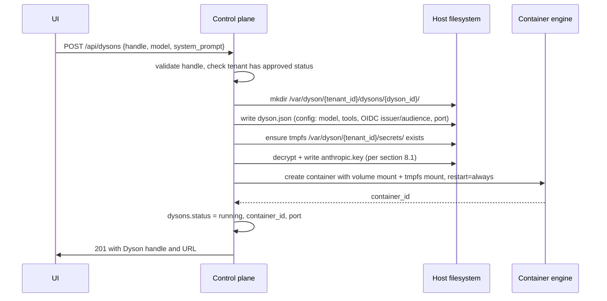

# Multi-tenant Dyson Orchestrator — Planning

> **Status: thought experiment / future work.** Nothing here is built or
> committed to. This document captures a design pass for a hypothetical
> orchestrator that *would* sit around Dyson if we ever shipped a hosted
> multi-tenant offering. It exists to pre-think the hard decisions (BYOK
> custody, KMS, auth, fleet model) so that if we do start scaffolding,
> we're not starting from zero. Treat dollar figures, table schemas, and
> sequence diagrams as illustrative — they will drift before any of this
> turns into code.

A planning sketch for a **separate** orchestrator project (not part of the
`dyson` crate) that would host multi-tenant Dyson on a single small VPS. Dyson
stays unmodified; the orchestrator is a control plane around it.

Where the design pass landed: swarm orchestration is out, but **multi-Dyson per
tenant is in**, each tenant owning its own KMS CMK, with namespaces reserved as
a future container for multi-tenant orgs.

---

## 1. Goal and non-goals

**Goal.** Let an authenticated user sign up, get an isolated Dyson environment
on a private subdomain, and spin up multiple named Dysons inside it (e.g.
`research-bot`, `triage-bot`). The user brings their own LLM API key (BYOK).
The operator (you) carries no per-tenant marginal cost.

**Non-goals at MVP.**

- No platform-funded LLM trial pool. BYOK only.
- No per-Dyson sandboxing within a tenant. All Dysons under one tenant share a
  trust domain.
- No multi-region. Single VPS. HA is later.
- No changes to Dyson itself. The orchestrator deals only with what's outside
  the Dyson process boundary.

---

## 2. Locked decisions

| Topic | Decision |
|---|---|
| Identity provider | **GCP Identity Platform** (GIP), Standard tier |
| KMS | **GCP KMS, one CMK per tenant** |
| Secret custody | Envelope encryption: tenant CMK wraps a per-row DEK |
| Secret transport into Dyson | Tmpfs-mounted file in the container |
| Egress to LLM provider | **Direct from Dyson** to upstream (no proxy) |
| LLM cost model | **BYOK only** at MVP |
| Tenancy unit | Subdomain per tenant, multiple Dysons per tenant via path |
| Compute | Hetzner CX32 (€7/mo, 4 vCPU / 8 GB) |
| DNS / wildcard cert | Cloudflare DNS API + ACME DNS-01 |
| Control plane lang | Go (matches GCP/Cloudflare SDK ergonomics) |
| Control plane DB | Postgres (Neon free tier or Hetzner-local) |

---

## 3. Locked decisions (formerly open)

1. **Operator break-glass: yes.** A named human IAM role holds
   `kms:cryptoKeyEncrypterDecrypter` alongside the controlplane service
   account. MFA-required, short-lived credentials, every human decrypt
   audit-logged and alerted on. Trade accepted: compromised operator account
   = all tenants exposed.
2. **GIP Standard.** Premium (per-tenant user pools) earned only when an
   enterprise asks for tenant-scoped SSO.
3. **No per-Dyson secret scoping.** All Dysons under one tenant share the
   tenant's secret pool. Same trust domain, same tmpfs mount. The phase-2
   trigger is clear: when tenants run Dysons on behalf of less-trusted
   automation (public webhook handlers, third-party MCP servers), scoping
   earns its keep — the `dysons.scope` column in §15 keeps the door open.

---

## 4. Component architecture



The router is the single ingress, single egress to GCP, and the only thing that
talks to Postgres. Dyson containers are leaves; they read their config and
secret files from disk, verify inbound JWTs, and call upstream LLMs directly.

---

## 5. Data model

```sql
-- ---- identity ----
users (
  id                uuid pk,
  gip_uid           text unique,           -- Firebase/GIP user id
  email             citext unique,
  email_verified    bool not null default false,
  created_at        timestamptz not null,
  last_login_at     timestamptz,
  suspended_at      timestamptz
);

-- ---- namespace (org/account) ----
-- 1:1 with tenants at MVP. Reserved as the future container for multi-tenant
-- organizations (e.g. "Acme Corp" namespace holding dev/staging/prod tenants).
-- Not a trust boundary — secret isolation still happens at the tenant level.
namespaces (
  id                uuid pk,
  handle            text unique,           -- short label, e.g. "acme"
  display_name      text not null,
  owner_user_id     uuid not null references users(id),
  created_at        timestamptz not null
);

-- ---- tenancy ----
tenants (
  id                uuid pk,
  namespace_id      uuid not null references namespaces(id),
  handle            text unique,           -- subdomain label, e.g. "fluffy-otter-42"
  user_id           uuid not null references users(id),
  status            text not null,         -- pending_approval | active | suspended | deprovisioning | deleted
  cmk_resource_id   text not null,         -- full GCP KMS key resource name for this tenant
  volume_path       text not null,         -- /var/dyson/{tenant_id}
  created_at        timestamptz not null,
  approved_at       timestamptz,
  deprovisioned_at  timestamptz
);

-- ---- N Dysons per tenant ----
dysons (
  id                uuid pk,
  tenant_id         uuid not null references tenants(id),
  handle            text not null,         -- e.g. "research-bot"
  system_prompt     text,                  -- nullable, falls back to default
  model             text not null,         -- "claude-opus-4-7", etc.
  tools_allowed     text[] not null default '{}',
  status            text not null,         -- provisioning | running | stopped | failed
  container_id      text,                  -- engine-specific
  port              int,                   -- bound port on host loopback
  created_at        timestamptz not null,
  unique (tenant_id, handle)
);

-- ---- BYOK + tool secrets ----
tenant_secrets (
  id                uuid pk,
  tenant_id         uuid not null references tenants(id),
  provider          text not null,         -- "anthropic" | "openai" | "mcp:github" | ...
  name              text not null,         -- "default" or user-chosen label
  ciphertext        bytea not null,        -- DEK-encrypted secret value
  nonce             bytea not null,        -- AEAD nonce
  wrapped_dek       bytea not null,        -- DEK wrapped by tenant CMK
  last4             text not null,         -- for UI display only
  last_rotated_at   timestamptz not null,
  last_used_at      timestamptz,
  created_at        timestamptz not null,
  unique (tenant_id, provider, name)
);

-- ---- onboarding ----
invites (
  code              text pk,               -- short, human-typeable
  created_by        uuid references users(id),
  used_by           uuid references users(id),
  expires_at        timestamptz,
  used_at           timestamptz
);

-- ---- audit ----
audit_log (
  id                bigserial pk,
  tenant_id         uuid,
  user_id           uuid,
  action            text not null,         -- "secret.create", "dyson.start", "kms.decrypt", ...
  detail            jsonb,
  created_at        timestamptz not null
);
```

Notes:

- `namespaces` is 1:1 with `tenants` at MVP. The signup flow auto-creates a
  namespace alongside the tenant; the UI doesn't surface namespaces as a
  concept. Existence is purely structural: a place to attach multi-tenant
  orgs and namespace-level billing later without migrating.
- **Secret isolation stays at tenant**, not namespace. Two tenants in the
  same namespace cannot read each other's secrets — they have separate CMKs,
  separate volumes, separate UIDs, separate JWT audiences. The namespace is
  organizational, not a trust boundary.
- `tenants.cmk_resource_id` is the load-bearing field for crypto-shred:
  deleting that CMK destroys all `tenant_secrets` even if you still hold
  ciphertext.
- `tenant_secrets.provider` is a free-form string from day one, not an enum.
  This lets MCP server credentials slot in without a migration.
- `dysons` is a separate table from `tenants` because the user's directive is
  multiple Dysons per tenant. The `(tenant_id, handle)` unique constraint
  scopes the friendly name.

---

## 6. Tenant lifecycle



Stages:

1. **Signup.** GIP creates the user. We create a `tenants` row in
   `pending_approval`. No Dysons exist yet.
2. **Email verification.** Standard GIP flow. We mark `users.email_verified`
   from a GIP blocking function or polling.
3. **Approval.** Operator runs `controlplane tenants approve <handle>` (or
   clicks an admin button). Approval is the trigger for everything expensive:
   CMK creation, DNS record, volume creation, first Dyson provisioning.
4. **Active.** Tenant logs in, is redirected to their subdomain, sees an empty
   state, pastes their Anthropic key, creates a Dyson, starts using it.
5. **Suspension.** Reversible. Containers stopped, secrets stay encrypted in
   place, CMK retained.
6. **Deprovisioning.** Container stop → volume delete → DNS record delete →
   **CMK schedule for destruction (7-day default)** → row update to `deleted`.
   The CMK destruction is the crypto-shred step. After 7 days, even a Postgres
   backup containing the wrapped DEK is unrecoverable.

---

## 7. Multiple Dysons per tenant

Each tenant has 0..N Dysons in the `dysons` table. They share:

- The tenant's volume root (`/var/dyson/{tenant_id}/`), but each Dyson gets its
  own subdirectory `dysons/{dyson_id}/` for its own working tree, chat
  persistence, and config.
- The tenant's secret pool (BYOK key, MCP creds). Every Dyson under one tenant
  reads from the same tmpfs mount. Per-Dyson scoping is not in MVP.
- The tenant's CMK. There is no per-Dyson CMK.

Each Dyson has its own:

- Container (Docker / containerd / systemd-nspawn — TBD by orchestration
  tooling, but the abstraction is "one process tree per Dyson").
- Loopback port assigned by the router.
- `dyson.json` config file generated at provisioning, read at startup.
- Optional system prompt and model override stored in the `dysons` row.

**Routing inside a tenant.** Subdomain identifies the tenant; path identifies
the Dyson:

```
fluffy-otter-42.myprivate.network/                  -> tenant home (UI)
fluffy-otter-42.myprivate.network/d/research-bot/   -> Dyson UI
fluffy-otter-42.myprivate.network/d/research-bot/api/...  -> Dyson API
fluffy-otter-42.myprivate.network/api/dysons        -> orchestrator API: list/create/delete
```

The router resolves `(host, path-prefix)` to `(tenant_id, dyson_id)`, mints a
short-TTL JWT scoped to `aud=dyson:{dyson_id}, tenant:{tenant_id}`, and proxies
to the right loopback port.

**Resource caps.** With N Dysons per tenant, idle ones cost very little (Dyson
processes mostly sleep), but a runaway can still saturate. Per-tenant cgroup
caps from day one: total CPU shares, total RAM, total open files. Per-Dyson
caps not in MVP — tenant is responsible for not running 50 of them.

---

## 8. BYOK and per-tenant CMK

### 8.1 The pattern

```
secret = "sk-ant-..."               (tenant's Anthropic key, never on disk in plaintext)
DEK = AEAD-keygen()                 (random per-row data encryption key)
ciphertext, nonce = AEAD-seal(DEK, secret)
wrapped_dek = KMS.Encrypt(tenant_cmk, DEK)
zero(DEK)

INSERT INTO tenant_secrets (..., ciphertext, nonce, wrapped_dek, last4) VALUES (...)
```

To decrypt at Dyson provisioning time:

```
DEK = KMS.Decrypt(tenant_cmk, wrapped_dek)
secret = AEAD-open(DEK, nonce, ciphertext)
write secret to /var/dyson/{tenant_id}/secrets/anthropic.key (mode 0600, tmpfs)
zero(DEK); zero(secret)
```

### 8.2 Why per-tenant CMK (vs. single platform CMK)

| Property | Single CMK | Per-tenant CMK |
|---|---|---|
| Cost (10 / 1000 tenants, GCP) | $0.06/mo | $0.60 / $60/mo |
| Crypto-shred on deprovision | No | **Yes** (delete CMK) |
| Per-tenant audit log of decrypts | No | **Yes** |
| IAM scoping ("revoke just this tenant") | No | **Yes** |
| Compromised-CMK blast radius | All tenants | One tenant |

Cost stays trivial through ~1000 tenants. Past that, billing amortizes it.

### 8.3 IAM posture

Two principals hold `cloudkms.cryptoKeyEncrypterDecrypter` on every tenant CMK
(granted at CMK creation):

- **Controlplane service account** — used on every secret read/write during
  normal operation.
- **Operator break-glass IAM role** — a named human role for support and
  incident response. MFA-required. Use is rare and audited.

Every `Encrypt` and `Decrypt` is logged to GCP Cloud Audit Logs by default.
Mirror to the `audit_log` table on every successful decrypt with the calling
principal's identity. Alert on any human-principal decrypt — these should be
infrequent enough that "operator decrypted tenant X's key" is a notification,
not a metric.

### 8.4 Lifecycle

- **Set/update.** UI → controlplane → KMS encrypt → row insert/update. Optional
  test connection (1-token completion or `/v1/models`) before committing.
- **Read-back.** Never. Only `last4` and metadata returned.
- **Rotation.** Tenant pastes new key; we keep both rows (`name="default"` and
  `name="next"`) for a window, then promote and delete the old. Dyson reads the
  current file; on rotation, controlplane writes the new file and signals the
  Dyson to reload (SIGHUP if supported, container bounce otherwise — MVP:
  bounce).
- **Revocation.** Tenant deletes a row. Controlplane removes the file from
  tmpfs and bounces affected Dysons.
- **CMK destruction.** Only at tenant deprovisioning. Scheduled with the GCP
  default 7-day window so accidents are reversible during that window.

### 8.5 Logging hygiene

- Centralized log redactor on the controlplane: regex sweep for `sk-ant-...`,
  `sk-...`, `ghp_...`, `xoxb-...`, etc.
- Wrap all secret-bearing types in Go with a `Redacted[T any]` whose `String()`
  and `MarshalJSON` return `***`. Never `fmt.Printf("%v", secret)` raw.
- Backups: pgdumps include ciphertext (fine, useless without CMK). The
  controlplane host's KMS service-account JSON must not be in any backup.

---

## 9. Auth (GCP Identity Platform)

### 9.1 What GIP gives us

- OIDC provider at `https://securetoken.google.com/{project-id}`.
- Email + password, MFA (TOTP, SMS), magic links, passkeys, OIDC/SAML
  federation — all enabled or disabled by config.
- JS REST API for signup/verify/login that we call from our own pages on
  `auth.myprivate.network`. No Google branding.
- Free up to 50,000 MAU on Standard tier. Cost at MVP scale: $0.

### 9.2 Token flow

```
Browser ──signup/login──> auth.myprivate.network (controlplane page)
controlplane ──REST──> GIP signupNewUser / verifyPassword
GIP ──ID token──> controlplane
controlplane ──verifies token, looks up tenant_id, mints scoped JWT──>
              browser cookie (HttpOnly, SameSite=Lax)
Browser ──cookie──> {handle}.myprivate.network
controlplane verifies cookie, proxies to Dyson with Authorization: Bearer {scoped JWT}
Dyson verifies via auth/oidc.rs (issuer = controlplane, allowed_sub = tenant_id)
```

The scoped JWT is short-TTL (15 min), refreshed automatically while the GIP
refresh token is valid (30 days). Re-issuing locally rather than passing the
GIP token through means leaked tokens can't move between tenants — `aud` is
`tenant:{handle}` not project-wide.

### 9.3 Login UX surface we own

- `/signup` (with invite code field)
- `/login`
- `/verify` (email link landing)
- `/forgot-password`, `/reset-password`
- `/account/mfa` (enroll)
- "Pending approval" page after signup

All are templated pages served by the controlplane on `auth.myprivate.network`.
None need a SPA; plain Go templates + a few `htmx` interactions are enough.

### 9.4 Why not embed OIDC, run Zitadel, etc.

Embedded OIDC = ~1500 lines of Go we don't need. Zitadel adds a stateful
service to operate. GIP is free at this scale and we're already in GCP for
KMS — adding it costs nothing in operational complexity.

---

## 10. Routing and DNS

### 10.1 DNS

- Wildcard `*.myprivate.network` -> Hetzner host IP via Cloudflare.
- Auth subdomain `auth.myprivate.network` -> same host.
- ACME DNS-01 challenge against Cloudflare API. Single wildcard cert covers
  all tenants. Renewal is fully automated, no per-tenant cert work.
- Per-tenant A records optional — wildcard is sufficient. We create an A
  record on approval mostly to make `dig` results explicit and let the operator
  sanity-check.

### 10.2 Routing

Router (Go) does:

1. Inbound HTTPS, terminates TLS with the wildcard cert.
2. Host header → tenant lookup. Cache `(handle -> tenant_id)` in memory; reload
   on tenant changes via Postgres LISTEN/NOTIFY or short TTL.
3. Cookie → user lookup → tenant membership check (does this user own this
   tenant?). On mismatch, redirect to login.
4. Path → Dyson lookup or orchestrator API:
   - `/d/{dyson-handle}/...` → forward to that Dyson's loopback port.
   - `/api/dysons`, `/api/secrets`, `/api/tasks`, etc. → handled by the
     orchestrator itself.
   - `/` → tenant UI (lists Dysons, links to recent activity, "create Dyson"
     button).
5. JWT minting and forwarding to Dyson on each proxied request.

---

## 11. Provisioning sequence (per Dyson)

This is what "user clicks 'create Dyson' in the UI" runs end-to-end:



Things to keep in mind:

- The tmpfs mount is shared across all Dysons in the tenant (since they share
  the secret pool). Mount is `noexec, nosuid, nodev, mode=0700`.
- The Dyson container runs as a non-root UID owned by the tenant. UIDs are
  allocated from a per-tenant range so filesystem ACLs are enough to keep
  tenants apart even on a flat filesystem.
- The Dyson container has no GCP credentials, no Postgres credentials, no
  Cloudflare credentials. It can only see its own filesystem and reach the
  internet (for upstream LLM). Egress to GCP/Cloudflare/Postgres is firewalled
  off at the host level.
- `dyson.json` has the OIDC verifier configured with
  `issuer = https://{handle}.myprivate.network` (the controlplane re-issuer)
  and `allowed_sub = "tenant:{handle}"`. This is exactly what
  `crates/dyson/src/auth/oidc.rs` already supports.

---

## 12. Deprovisioning and crypto-shred

Tenant deletion is the single hardest path to get right. The sequence:

1. `tenants.status = deprovisioning`. UI access disabled.
2. For each Dyson under the tenant: stop container, remove container,
   `dysons.status = stopped`.
3. Unmount tmpfs. (Secret files vanish.)
4. Delete tenant volume tree. Two-pass: shred files, then unlink.
5. Delete Cloudflare DNS records.
6. **Schedule CMK destruction in GCP KMS** (default 7-day window).
7. Mark all `tenant_secrets` rows with `deleted_at` (don't truncate yet — wait
   until CMK destruction completes for paper-trail consistency).
8. After 7 days: KMS confirms CMK destroyed → `tenants.status = deleted`,
   `tenant_secrets` rows truncated.

The crypto-shred property: between step 6 and the CMK destruction completing,
recovery is possible (tenant changed mind). After CMK destruction, even a
controlplane DB backup with the wrapped DEK is unrecoverable. This is the GDPR
"right to erasure" story without having to scrub backups.

---

## 13. Cost picture

| Line item | Monthly | Note |
|---|---|---|
| Hetzner CX32 (4 vCPU / 8 GB) | €7.00 | Holds router + ~10–30 idle Dysons |
| Hetzner backups (+20%) | €1.40 | Worth it for the controlplane DB |
| GCP KMS, per-tenant CMK | $0.06 × N | $0.60 at 10 tenants, $6 at 100 |
| GCP KMS ops | <$1 | Cache decrypted DEKs in memory at Dyson start |
| GCP Identity Platform | $0 | Free under 50,000 MAU |
| Cloudflare DNS + cert + CDN | $0 | All free tier |
| Postgres (Neon free tier) | $0 | 0.5 GB storage, plenty for the schema |
| Email (Postmark / Resend / SES) | $0–10 | Verification + reset emails |
| **Total at 10 tenants** | **~€10 / ~$11** | Includes everything |
| **Per-tenant marginal** | **$0** | BYOK = tenant pays Anthropic |

Where the bill bends:

1. **Multiple busy Dysons per tenant.** Idle Dysons are cheap; busy ones at
   ~150 MB RSS each mean a tenant running 5 active Dysons uses ~750 MB. 8 GB
   host comfortably holds ~40 active Dysons across all tenants. CPX31 (€13,
   16 GB) is the next step.
2. **Storage growth.** Hetzner volumes at €0.044/GB/mo. Negligible until
   tenants store real artifacts.
3. **CMK count.** Linear in tenant count. At 10,000 tenants = $600/mo just for
   CMKs — the crossover point where we'd want to revisit the per-tenant-CMK
   decision.

---

## 14. Threat model summary

| Attack | Mitigation |
|---|---|
| Stolen Postgres dump | Wrapped DEKs are useless without CMK access. Attacker also needs GCP IAM compromise. |
| Stolen host disk | Same: secrets are encrypted. The controlplane KMS service-account JSON is on the host though — if rooted, attacker can decrypt. Host hardening + service account rotation matter. |
| Compromised one tenant's Dyson | Tenant-scoped JWT means the leaked token can't reach another tenant. Tenant volume + UID ACLs keep filesystem isolated. CMK is per-tenant so KMS access from inside that Dyson (which we don't grant) is also single-tenant. |
| Operator with prod shell | Break-glass IAM role exists by design (decision §3.1). MFA-required, all decrypts audit-logged with human identity, alerts fire on use. Compromise level: same as full host root + MFA bypass. |
| Tenant pastes key into wrong tenant via XSS | Strong CSP, HttpOnly + SameSite cookies, no inline scripts on the secrets page, audit-log every secret create/update with IP + user agent. |
| Tenant uses platform to launder API requests | BYOK is the defense — they're paying upstream directly. Egress logs (count only, never content) catch volume anomalies. |
| Lost MFA device, locked-out user | GIP handles MFA recovery flows. Account-recovery is one of the support burdens we accept by owning users. |
| Fired admin retains GCP access | Standard org IAM hygiene. Out of scope here, named for completeness. |

---

## 15. Phase 2 hooks worth designing in now

Don't build, but don't preclude:

- **Multi-tenant namespaces.** Schema already has `namespaces` as the parent of
  `tenants`. Going from 1:1 to 1:N is a UI change (namespace switcher, member
  invites) plus a billing roll-up — no migration. Secrets stay at tenant level
  even when a namespace contains many tenants.
- **Pluggable secrets backend.** `SecretsStore` interface with one Postgres
  impl now. Vault impl later if a customer demands it.
- **Tenant→Dyson host mapping is a list, not a singleton.** Schema:
  `dyson_hosts(tenant_id, dyson_id, host_addr, primary bool)`. Lets you add a
  second host later without migrating.
- **Free-form `provider` column on `tenant_secrets`.** MCP creds slot in
  without a schema change.
- **`dysons.scope` (text, nullable).** Reserve a column for per-Dyson secret
  scoping when a tenant asks. Doesn't need to be implemented today.
- **`audit_log` everywhere.** Cheap to write, expensive to retrofit. Log every
  decrypt, every secret mutation, every Dyson lifecycle event from day one.
- **Federation login.** GIP supports adding Google / GitHub / SAML as
  additional sign-in methods later. Login pages should be written so adding a
  "Sign in with Google" button is a config change, not a redesign.
- **Per-tenant budget cap on LLM spend.** Not enforceable without an egress
  observability pipeline (out of scope at MVP), but reserve `tenants.max_spend_usd_per_day`
  as a column so the UI can show "ceiling: not enforced yet".

---

## 16. What this orchestrator is *not* (re-stated for clarity)

- Not a Dyson fork. The Dyson binary that runs in tenant containers is the
  unmodified `dyson` crate from this repo, configured via `dyson.json` and the
  existing OIDC + secrets-resolver primitives.
- Not a swarm coordinator. Multiple Dysons per tenant exist, but the
  orchestrator does not schedule tasks across them, share memory between them,
  or aggregate their output. They are independent agents that happen to share
  a tenant.
- Not a billing / metering platform. BYOK pushes that to upstream. The
  orchestrator's audit log tracks lifecycle events, not token spend.
- Not multi-region. Single-host MVP. HA, replication, and geo-routing are
  earned, not designed in.

---

## 17. Suggested first commits (if/when this gets scaffolded)

In rough order, each a self-contained chunk of ~1–2 days:

1. Postgres schema migrations (§5) + a migration tool.
2. Cloudflare DNS client + ACME DNS-01 wildcard cert.
3. Router skeleton: TLS, host-based tenant lookup, cookie auth, static
   "hello" handler.
4. GIP integration: signup/login/verify pages, token verification.
5. Tenant approval flow + admin CLI.
6. Per-tenant CMK + envelope encryption library.
7. Dyson provisioning: config, tmpfs secret, container start, port assign.
8. Tenant UI: list/create Dysons, paste BYOK, proxy to `/d/{handle}`.
9. Deprovisioning + CMK destruction + crypto-shred test.
10. Audit log writer integrated across all of the above.

By #5 you have signups. By #8 you have something demonstrable.
