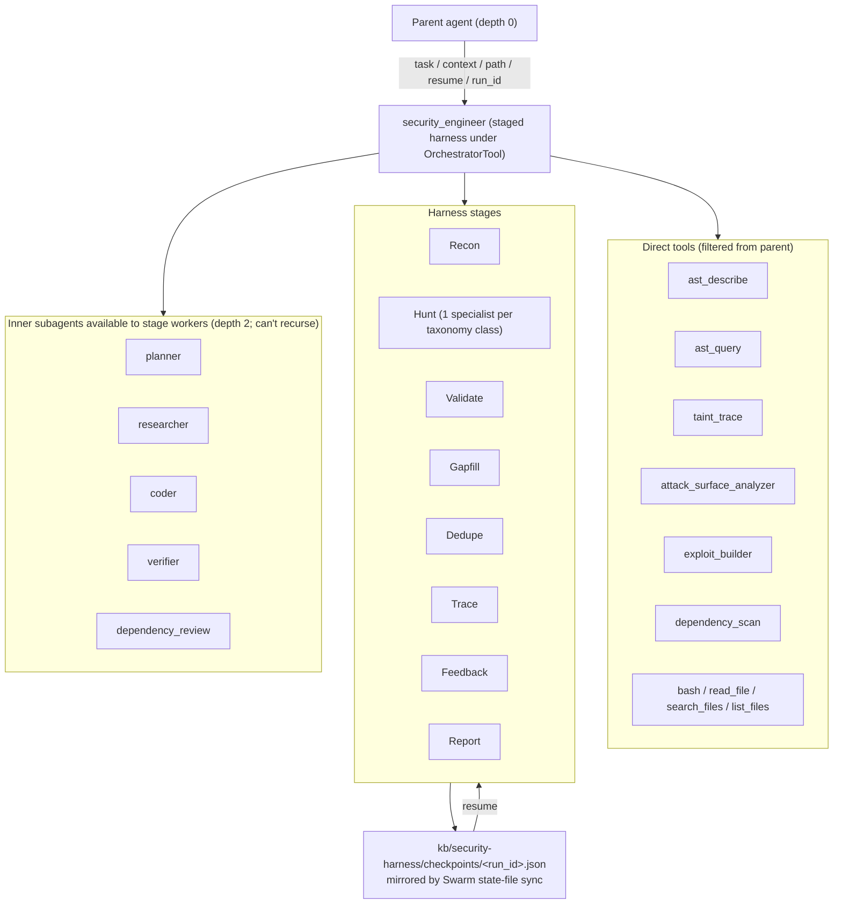

# Security Engineer Subagent

`security_engineer` is Dyson's staged security research harness.  The parent-facing tool name is stable for allowlists and UI configuration, but the implementation runs a checkpointed pipeline rather than a single broad "review this repo" call:

```
Recon → Hunt → Validate → Gapfill/follow-up → Dedupe → Trace → Judgment → Feedback/consumer follow-up → Report
```

The harness writes durable checkpoint JSON to `kb/security-harness/checkpoints/<run_id>.json` in the Dyson workspace (or `.dyson/security-harness/checkpoints/<run_id>.json` when no workspace is wired up).  In Swarm mode the path is mirrored by the existing state-file sync worker, so a review can resume after instance recreate, rollout, or interruption — no security-specific Swarm API needed.

## Methodology

The harness does not ask one model to audit a whole repo in one pass.  Each stage is a narrowly-scoped child agent run with a specific prompt + a JSON output contract:

1. **Recon** maps the architecture and trust boundaries; seeds taxonomy-driven hunt tasks.
2. **Hunt** fans out one class specialist per vulnerability taxonomy entry.  Every class is hunted unconditionally — see "Always-fan-out" below.
3. **Validate** decides per-finding: Confirmed, Rejected, NeedsMoreEvidence, Downgrade.  Can only decide on existing findings; cannot emit new ones.
4. **Gapfill** turns uncovered high-risk areas into more hunt tasks and immediately executes one bounded Hunt → Validate follow-up pass.
5. **Dedupe** collapses findings that share a root cause.
6. **Trace** establishes reachability from real entry points.
7. **Judgment** evaluates confirmed findings against repository-internal production wiring and configuration.
8. **Feedback** turns explicit reachable `consumer_paths` from Trace into one bounded Hunt → Validate → Trace → Judgment follow-up pass.
9. **Report** emits the evidence-backed Markdown report.

Checkpoints + reports track which taxonomy classes were considered, applicable, hunted, skipped, checked and cleared, or left for follow-up.

### Vulnerability taxonomy

The canonical taxonomy lives in [`taxonomy.rs`](../crates/dyson/src/skill/subagent/security_engineer/taxonomy.rs).  Currently 24 classes:

| Class id                          | Coverage                                                                  |
|-----------------------------------|---------------------------------------------------------------------------|
| `auth_authorization`              | auth checks, IDOR/BOLA, tenant bypass, role confusion                     |
| `session_oauth_csrf`              | OAuth state/nonce/PKCE, CSRF, cookie scope, session fixation              |
| `ssrf_outbound_network`           | DNS rebinding, cloud metadata, URL parser differentials, header proxying  |
| `proxy_http_boundary`             | hop-by-hop, smuggling, CORS, auth-header forwarding                       |
| `container_sandbox_runtime`       | Docker socket, dangerous flags, host mounts, sandbox escape               |
| `secrets_credentials`             | plaintext storage, KMS context, log exposure, cross-instance reuse        |
| `persistence_lifecycle`           | clone/restore secrets, recreate-stale-token, state-file replay            |
| `webhooks_inbound_integrations`   | webhook signature, replay, SSRF via webhook URL                           |
| `file_archive_path`               | zip-slip, symlink, path traversal, archive bombs                          |
| `injection_unsafe_execution`      | eval/exec, deserialization, template SSTI, SQLi, command injection        |
| `dependency_supply_chain`         | unpinned deps, malicious packages, lockfile drift                         |
| `crypto_randomness`               | weak primitives, RNG misuse, IV/nonce reuse, side channels                |
| `multi_tenant_isolation`          | shared caches, cross-tenant leakage, scoping bugs                         |
| `resource_exhaustion_dos`         | unbounded allocation, regex DoS, decompression bombs                      |
| `frontend_security_ux`            | XSS, clickjacking, CSP bypass, postMessage misuse                         |
| `agent_tool_boundary`             | MCP/tool prompt injection, capability escalation                          |
| `api_contract_input_validation`   | type confusion, mass-assignment-adjacent, schema drift                    |
| `audit_observability_forensics`   | tamperable logs, audit gaps, evidence destruction                         |
| `ci_cd_release_integrity`         | poisoned workflows, secrets in CI, unsigned artifacts                     |
| `data_retention_privacy`          | over-retention, missing erasure, PII leakage                              |
| `race_condition_toctou`           | check-then-use, double-fetch, lock-bypass                                 |
| `business_logic_abuse`            | abuse paths through legitimate APIs, voucher/refund races                 |
| `mass_assignment_overposting`     | uncontrolled binding, allowlist gaps                                      |
| `denial_of_wallet_cost_abuse`     | unbounded paid-call surface, cost-amplifying loops                        |

### Always-fan-out

[`ensure_taxonomy_hunt_tasks`](../crates/dyson/src/skill/subagent/security_engineer/taxonomy.rs) queues one hunt task per class regardless of what recon said.  Weaker models tend to drop the `class_coverage` field, mark everything inapplicable, or hallucinate skip reasons — letting the per-class specialist decide "no work here" is more reliable than letting recon decide "no specialist needed."  A specialist that finds nothing exits cheaply; the harness then marks the class hunted-and-cleared.

### Per-stage iteration caps

Each stage's child agent loop has its own iteration cap, named in [`security_engineer/mod.rs`](../crates/dyson/src/skill/subagent/security_engineer/mod.rs):

| Stage      | Constant                    | Value | Why                                                                |
|------------|-----------------------------|------:|--------------------------------------------------------------------|
| Recon      | `RECON_MAX_ITERATIONS`      |    60 | Reads the WHOLE scope before any specialist runs.  Was 12 originally; a deepseek-v4-pro recon doing ~50 tool calls per turn blew through it and the agent loop's summarize-on-cap path returned prose instead of JSON — the recon→hunt transition died silently. |
| Hunt       | `HUNT_MAX_ITERATIONS`       |    28 | One specialist per class, parallel waves; 28 turns is enough for "find sinks → trace → emit findings or empty."                                                                                  |
| Validate   | `VALIDATE_MAX_ITERATIONS`   |    16 | Per-finding decisions on a bounded list.                                                                                                                                                          |
| Trace      | `TRACE_MAX_ITERATIONS`      |    16 | Per-finding reachability decisions.                                                                                                                                                              |

### Permissive parsing, strict semantics

Stage outputs are JSON, but the model is the producer.  Three layers of strictness, each calibrated separately:

1. **Field deserialization.**  Every Deserialize struct field carries `#[serde(default)]`.  A model that omits, mistypes, or merely renames a field gets defaults, not a deserialization error.
2. **Stage-boundary parsing.** Recon remains permissive. A malformed Hunt specialist is recorded as degraded coverage and never as checked-and-cleared. Missing Validate, Trace, or Judgment results become explicit `needs_more_evidence`/unknown records plus coverage gaps, so a single bad worker does not kill the run or fabricate a negative verdict.
3. **Semantic validation.**  Stays strict and fails the run.  The validator cannot reference a finding_id that doesn't exist, cannot confirm a finding missing required evidence fields, cannot confirm a no-vulnerability note as if it were a real finding.  Dedupe groups cannot point at unknown findings.  This is the quality floor — letting it through would put fabricated data into the report.

Every catastrophic failure mode we debugged on live runs was at layer 2 (greedy `extract_json`, missing-field rejection, parse-fail-kills-run).  Each was fixed by moving the failure from "die" to "warn and continue."  Layer 3 keeps the floor intact — the harness still fails loudly when the model violates a contract, just not when the model produces malformed JSON.

## Code pointers

- [`security_engineer/`](../crates/dyson/src/skill/subagent/security_engineer/) — the 9-file staged harness module:
  - `mod.rs` — public API, `security_engineer_config()`, `STAGES` const, harness inner loop, per-stage iteration caps
  - `types.rs` — `SecurityCheckpoint`, `SecurityFinding`, `SecurityTask`, etc. (all Deserialize fields default-tolerant)
  - `checkpoint.rs` — `CheckpointStore`, resume logic, time/scope/git helpers
  - `taxonomy.rs` — the vulnerability class table + class lookup + coverage tracking + per-class fan-out
  - `runtime.rs` — `SecurityHarnessRuntime`, `spawn_stage`, child-output merging
  - `stages.rs` — the 9 stage runners + hunt fan-out and bounded follow-up helpers
  - `stack.rs` — language/framework stack specialists + provably-moot class pruning
  - `parse.rs` — JSON extraction + per-stage parsers + report schema validation (shape vs semantic split)
  - `report.rs` — Markdown rendering + dedupe + reportable-finding filtering
- [`prompts/security_engineer.md`](../crates/dyson/src/skill/subagent/prompts/security_engineer.md) and `security_engineer_<stage>.md` — shared and per-stage prompts
- [`prompts/security_engineer_protocol.md`](../crates/dyson/src/skill/subagent/prompts/security_engineer_protocol.md) — when-to-invoke fragment injected into the parent's prompt

Related:
- [Subagents overview](subagents.md) — orchestrator framework + composition model
- [Testing](testing.md) — smoke/regression/live-review infrastructure

## Staged harness



On invocation:

1. Parent calls `security_engineer({ task, context?, path? })`.
2. `OrchestratorTool::run` canonicalises `path` to a scoped review root.
3. The harness creates a checkpoint with run id, target path + ref, scope, current stage, vulnerability-class coverage, completed/pending tasks, findings, validation decisions, dedupe groups, trace results, gapfill tasks, report validation state, timestamps, provider/model metadata, harness version, and schema version.
4. Each stage worker receives the current checkpoint JSON and a stage-specific prompt. Recon creates narrow taxonomy-driven hunt tasks; the taxonomy fan-out ensures every class is queued regardless; Hunt completes bounded task batches; Validate decides on existing findings only; Gapfill and Feedback can execute one bounded follow-up cycle; and Report must pass schema validation. Canonical checkpoint findings remain authoritative even when the report model supplies an optional suggested patch.
5. After every major stage and completed hunt wave, the harness saves the checkpoint.

On resume:

1. Parent calls `security_engineer({ "task": "resume security review", "resume": true, "run_id": "sec-..." })`.
2. If `run_id` is omitted and exactly one incomplete checkpoint matches the current `target_path`, the harness resumes it.  Multiple matches return a concise run-id list; zero matches return a clear error.
3. Completed tasks and completed stages are skipped.  Unsupported `schema_version` or `harness_version` fails safely.

## Output schema

```
## CRITICAL
### <one-line finding title>
- **File:** `path/to/file.ext:LINE`
- **Evidence:** ```<exact text at the cited line>```
- **Attack Tree:**
  <entry file:line> — <external entry>
    └─ <hop file:line> — <what this hop does>
      └─ <sink file:line> — <unsafe operation>
- **Taint Trace:** (verbatim tool output OR "not run within budget" disclaimer)
- **Impact:** <concrete outcome — no "may"/"could"/"might">
- **Exploit:** <one payload; required for eval/exec/SQL/deser/SSTI/redirect>
- **Remediation:** <specific fix with corrected snippet>
```

Repeated for `## HIGH`, `## MEDIUM`, `## LOW / INFORMATIONAL`.  Every report has all seven sections; sections with no findings carry `No findings.` on their own line — do not silently skip.

Then: `## Checked and Cleared`, `## Dependencies`, `## Remediation Summary`.

A Pre-Submit Check in [security_engineer.md](../crates/dyson/src/skill/subagent/prompts/security_engineer.md) runs before the report ships.

## Evaluating report quality

Signals to grade on:

- **Attack Tree depth.**  Non-trivial findings carry 2–3 resolved hops.  Single-hop trees above MEDIUM mean `taint_trace` was skipped or fed weak sources/sinks.
- **`resolved_hops / total_hops`.**  Consistent `1/2` or `0/1` means `ast_query` wasn't run first to find real sources and sinks.
- **`UnresolvedCallee` rate.**  Baselines from `examples/smoke_taint_trace.rs`: 0–2% imperative languages, ~25% Haskell (typeclasses), ~30% Nix (attribute paths).  A spike on a supported language is a `flatten_callee` bug — minimise to a fixture and add a regression test in `tests/ast_taint_patterns.rs`.
- **`[TRUNCATED]` in the index header.**  Repo exceeded `TAINT_MAX_FILES = 5000`.
- **"Checked and Cleared" on expected-vulnerable code.**  Usually `taint_trace` returned NO_PATH when it shouldn't — wrong source line or a non-tier-1 language missing assignment propagation.
- **Fabrication scan.**  `grep -c "taint_trace: lossy" report.md` should equal the number of real `taint_trace` tool calls in the run's log.
- **Preamble scan.**  First non-whitespace char of the report should be `#`.

## Iterating on the harness

### Stage-isolated probes (cheap)

Before paying for a full pipeline run, probe individual stages against a real LLM via [`security_engineer_stage_smoke`](../crates/dyson/examples/security_engineer_stage_smoke.rs).  The harness's `stop_after_stage` + `resume` + `run_id` inputs let each stage read + write the same checkpoint:

```bash
# 1. Fresh recon — ~$1–$3 on a ~100-file scope
cargo run -p dyson --release --example security_engineer_stage_smoke -- \
    --config dyson.json \
    --target /path/to/repo \
    --task "review distributed/" \
    --stage recon
# ↳ saves output and checkpoint to stage-smoke-output/recon-<run_id>.{md,checkpoint.json}

# 2. Hunt against that recon — ~$3–$8, per-class specialists fan out
cargo run -p dyson --release --example security_engineer_stage_smoke -- \
    --target /path/to/repo --stage hunt --run-id sec-…

# 3. Validate / Trace / Report — pennies each
```

`--model claude-haiku` vs `--model deepseek/deepseek-v4-pro` against the same recon checkpoint isolates "is this stage's prompt working on this model" from "is the recon any good."

Each invocation persists `<stage>-<run_id>.md` + `<stage>-<run_id>-checkpoint.json` under `--output-dir`, so a post-mortem has both artifacts in one place — independent of the harness's canonical workspace location.

Strict failure detection: the smoke runner exits non-zero if (a) the tool returned an error, (b) no checkpoint was written, or (c) the saved `current_stage` did not advance to or past the requested stage.  Drive the full pipeline under `set -e`:

```bash
set -e
out=$(cargo run --release --example security_engineer_stage_smoke -- \
        --target /path --task "review distributed/" --stage recon)
run_id=$(echo "$out" | grep -oE 'run_id=sec-[a-z0-9-]+' | head -1 | cut -d= -f2)
for stage in hunt validate gapfill dedupe trace feedback report; do
    cargo run --release --example security_engineer_stage_smoke -- \
        --target /path --stage "$stage" --run-id "$run_id"
done
```

### Full-pipeline tuning (expensive)

[`expensive_live_security_review`](../crates/dyson/examples/expensive_live_security_review.rs) drives a full Recon → Report run against a fixed set of deliberately-vulnerable repos.  Use it for grading prompt regressions across diverse targets in one sweep.  Each run is billable (~$10–$30 per target on production models).

```bash
# Single target with distinct output
cargo run -p dyson --release --example expensive_live_security_review -- \
    --config dyson.json --target juice-shop --report-suffix iter1

# Pin to a version for CVE repro
cargo run -p dyson --release --example expensive_live_security_review -- \
    --config dyson.json --target react-server-19.2.0 --ref v19.2.0
```

Tool-call histogram from a log:

```bash
grep 'tool call started' /tmp/dyson-live-<target>-<iter>.log \
  | grep -oE '"[a-z_]+"' | sort | uniq -c | sort -rn
```

Prompt tunes do not get regression tests — LLM outputs are non-deterministic and a test asserting "a tool was called" is too weak.  The iteration transcript (logs + reports under distinct suffixes) is the test artifact.

### Quantitative benchmark scoring

The live-review example now copies each canonical durable report to `<output-dir>/<target>.json`. The versioned benchmark manifest at [`docs/evals/security-engineer-benchmark.json`](evals/security-engineer-benchmark.json) grades exact vulnerability class, path, root-cause language, minimum severity, known false-positive traps, duplicate ids, and line-qualified citations. Pass multiple independent sweep directories to measure variance:

```bash
cargo run -p dyson --example security_engineer_benchmark_score -- \
  --manifest docs/evals/security-engineer-benchmark.json \
  --reports-dir test-output/run-1 test-output/run-2 test-output/run-3
```

The scorer exits non-zero for missing reports, invalid citations/ids, root-cause recall below the manifest threshold, or forbidden-match rate above its threshold.

Code changes discovered in the loop (e.g. iteration cap bumps, parse-loosening, `OrchestratorTool.path`) get unit tests in the per-module `mod tests` blocks and in `crates/dyson/src/skill/subagent/tests.rs`.

## When to use

- Security review of a directory or module (scope via the `path` input)
- Pre-release vulnerability sweep against a pinned version (via `--ref`)
- After non-trivial changes to auth, crypto, or request-handling code — invoke as a validation step from the parent (see [`security_engineer_protocol.md`](../crates/dyson/src/skill/subagent/prompts/security_engineer_protocol.md))
- Reproducing a published CVE against a specific release

## When not to use

- General code review, style review, architecture review — use `researcher` / `verifier` instead
- One-off search for a specific line — direct `search_files` / `ast_query` from the parent is cheaper
- A codebase where the attack surface lives entirely outside the scope you can pass in `path` — the orchestrator canonicalises `path` and scopes its child agent there; `..` lookups won't reach out

## Known limits

- **`taint_trace` defaults.**  Per-call `max_depth=16` / `max_paths=10`.  For deeper classes (polymorphic deser, reflection-heavy dispatch, bean-binding walks) pass explicit `max_depth: 32, max_paths: 20` from the per-call input rather than bumping defaults.
- **Up-walk for scoped settings.**  Polyglot targets with config outside the scoped subpath leave secrets invisible to the scoped child.  An `up_walk: N` input on `OrchestratorTool` would let a caller widen the scope for settings-file reads without changing `working_dir`.  Not implemented.
- **Fabrication defence is soft.**  The Pre-Submit Check is a prompt rule.  A model that ignores it can still ship fabricated `Taint Trace:` blocks.  Harder defence: a post-hoc structural check in `OrchestratorTool::run` comparing `Taint Trace:` block count to the transcript's real `taint_trace` call count.  Not implemented.
- **Scope-delegation model limit.**  When the agent scopes to a wrapper package that delegates to a sibling for the unsafe op, prompt rules don't reliably override the "thin delegation" framing — the model reroutes around banned phrases.  The practical workaround is to scope at the package that contains the sink, not the wrapper.
