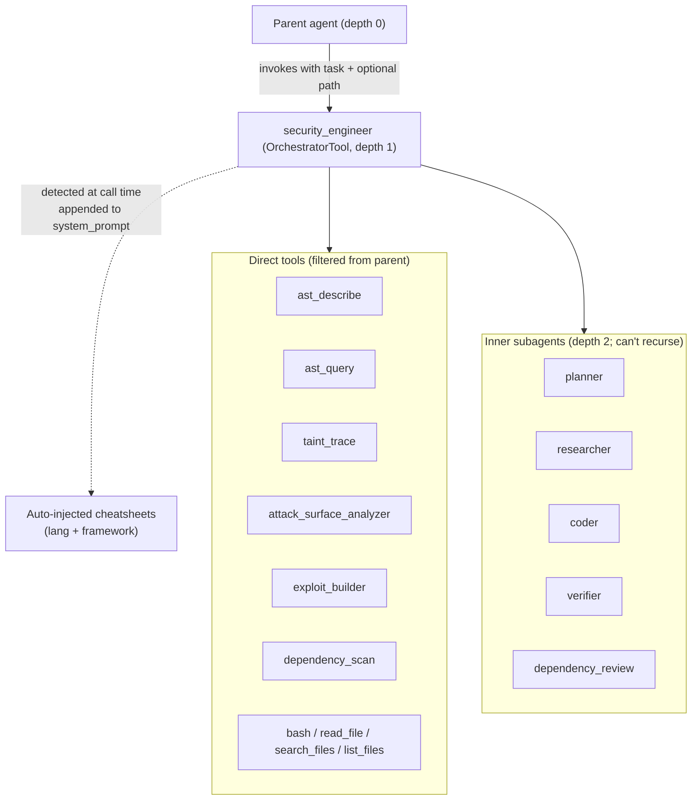

# Security Engineer Subagent

The `security_engineer` orchestrator is dyson's flagship subagent — a composable child agent that hunts reachable vulnerabilities in a target codebase using AST-aware tools, taint analysis, and parallel subagent dispatch.  This doc covers its architecture, the prompt techniques that make it work against production-scale (and production-weak) models, and the tuning loop for adapting it to new models.

Code pointers:

- [security_engineer.rs](../crates/dyson/src/skill/subagent/security_engineer.rs) — `security_engineer_config()` returns the `OrchestratorConfig`
- [security_engineer.md](../crates/dyson/src/skill/subagent/prompts/security_engineer.md) — the system prompt
- [security_engineer_protocol.md](../crates/dyson/src/skill/subagent/prompts/security_engineer_protocol.md) — the fragment injected into the parent's prompt (when-to-invoke guidance)
- [repo_detect.rs](../crates/dyson/src/skill/subagent/repo_detect.rs) — runtime cheatsheet detection
- [prompts/cheatsheets/](../crates/dyson/src/skill/subagent/prompts/cheatsheets/) — language + framework sheets

Related:

- [Subagents overview](subagents.md) — orchestrator framework + composition model
- [Testing](testing.md) — smoke/regression/live-review infrastructure

## Composition



On invocation:

1. Parent calls `security_engineer({ task, context?, path? })`.
2. `OrchestratorTool::run` canonicalises `path` to a scoped review root.
3. `repo_detect::detect_and_compose` shallow-parses manifests, returns cheatsheet markdown + the list of included sheet names (logged at INFO).
4. Cheatsheet body is concatenated onto the base `security_engineer.md` prompt; the child agent is spawned with the composed prompt.
5. Child runs up to 40 iterations / 8192 tokens per turn.  Inner subagents execute at depth 2.  Only the child's final assistant text returns to the parent.

## Cheatsheet injection

Sheets live at [prompts/cheatsheets/{lang,framework}/*.md](../crates/dyson/src/skill/subagent/prompts/cheatsheets/) and ship via `include_str!` — no runtime I/O, no binary bloat beyond ~620 lines of static markdown.

### Detection

[repo_detect.rs](../crates/dyson/src/skill/subagent/repo_detect.rs) walks two passes from the scoped review root:

- **Up** 5 ancestor directories, non-recursive — handles `juice-shop/routes/` scoping where `package.json` sits one level up.
- **Down** 3 depth levels via `ignore::WalkBuilder`, which already respects `.gitignore` (with `require_git(false)` so it bites on bare tarballs too), `.git/info/exclude`, global gitignore, and hidden files.  A supplementary skip list covers `node_modules`, `target`, `.venv`, `venv`, `__pycache__`, `dist`, `build`, `vendor`, `.next`, `.cache` for repos shipped without a `.gitignore`.

Coverage matches every tree-sitter grammar dyson's `ast_query` supports (13 langs) plus PHP (no in-tree grammar; the sheet still guides `read_file` / `search_files` work).  Manifests recognised:

| Lang | Manifests |
|---|---|
| Rust | `Cargo.toml` |
| JavaScript / TypeScript | `package.json` |
| Python | `pyproject.toml`, `requirements*.txt` |
| Go | `go.mod` |
| Ruby | `Gemfile`, `Gemfile.lock` |
| Java / Kotlin | `pom.xml`, `build.gradle`, `build.gradle.kts` |
| C# / .NET | `*.csproj`, `*.fsproj`, `*.vbproj` |
| PHP | `composer.json`, `composer.lock` |
| C / C++ | `conanfile.txt`, `conanfile.py`, `CMakeLists.txt` |
| Elixir | `mix.exs`, `mix.lock` |
| Haskell | `stack.yaml`, `cabal.project` |
| Swift | `Package.swift` |
| OCaml | `dune-project` |
| Erlang | `rebar.config` |
| Zig | `build.zig`, `build.zig.zon` |
| Nix | `flake.nix`, `default.nix`, `shell.nix` |
| Lua | `*.rockspec` |

Framework detection shallow-parses dependency tables:

| Manifest | Dep name / coord | Sheet |
|---|---|---|
| `package.json` | `express` | `framework/express` |
| `package.json` | `next` | `framework/nextjs` |
| `package.json` | `fastify` | `framework/fastify` |
| `package.json` | `@nestjs/core` / `@nestjs/common` | `framework/nestjs` |
| `package.json` | `@trpc/server` | `framework/trpc` |
| `package.json` | `koa` | `framework/koa` |
| `package.json` | `hono` | `framework/hono` |
| `package.json` | `@sveltejs/kit` | `framework/sveltekit` |
| `package.json` | `@remix-run/*` | `framework/remix` |
| `package.json` | `@apollo/server` / `apollo-server` / `graphql-yoga` | `framework/graphql` |
| `package.json` | `@hapi/hapi` | `framework/hapi` |
| `package.json` | `@adonisjs/core` | `framework/adonis` |
| `package.json` | top-level `meteor` key or `meteor-node-stubs` | `framework/meteor` |
| `package.json` | `nuxt` | `framework/nuxt` |
| `pyproject.toml` / `requirements*.txt` | `django` | `framework/django` |
| `pyproject.toml` / `requirements*.txt` | `flask` | `framework/flask` |
| `pyproject.toml` / `requirements*.txt` | `fastapi` | `framework/fastapi` |
| `pyproject.toml` / `requirements*.txt` | `aiohttp` | `framework/aiohttp` |
| `pyproject.toml` / `requirements*.txt` | `tornado` | `framework/tornado` |
| `pyproject.toml` / `requirements*.txt` | `sanic` | `framework/sanic` |
| `pyproject.toml` / `requirements*.txt` | `celery` | `framework/celery` |
| `pyproject.toml` / `requirements*.txt` | `starlette` | `framework/starlette` |
| `pyproject.toml` / `requirements*.txt` | `pyramid` | `framework/pyramid` |
| `pyproject.toml` / `requirements*.txt` | `falcon` | `framework/falcon` |
| `pyproject.toml` / `requirements*.txt` | `bottle` | `framework/bottle` |
| `Cargo.toml` | `actix-web` / `actix` | `framework/actix` |
| `Cargo.toml` | `axum` | `framework/axum` |
| `Cargo.toml` | `rocket` | `framework/rocket` |
| `Cargo.toml` | `warp` | `framework/warp` |
| `Cargo.toml` | `tonic` | `framework/tonic` |
| `Gemfile` | `gem 'rails'` | `framework/rails` |
| `Gemfile` | `gem 'sinatra'` | `framework/sinatra` |
| `pom.xml` / `build.gradle` | `spring-boot-starter-*` / `org.springframework` | `framework/spring` |
| `pom.xml` / `build.gradle` | `io.quarkus` | `framework/quarkus` |
| `pom.xml` / `build.gradle` | `io.micronaut` | `framework/micronaut` |
| `pom.xml` / `build.gradle` | `io.javalin` | `framework/javalin` |
| `pom.xml` / `build.gradle` | `com.typesafe.play` / `play-java` / `play-scala` | `framework/play` |
| `pom.xml` / `build.gradle` | `io.dropwizard` | `framework/dropwizard` |
| `pom.xml` / `build.gradle` | `io.helidon` | `framework/helidon` |
| `pom.xml` / `build.gradle` | `io.vertx` | `framework/vertx` |
| `build.gradle.kts` | `io.ktor:ktor-*` | `framework/ktor` |
| `*.csproj` / `*.fsproj` | `Microsoft.AspNetCore` | `framework/aspnet` |
| `composer.json` | `laravel/framework` | `framework/laravel` |
| `composer.json` | `symfony/framework-bundle` | `framework/symfony` |
| `composer.json` | `slim/slim` | `framework/slim` |
| `composer.json` | `codeigniter4/framework` | `framework/codeigniter` |
| `mix.exs` | `{:phoenix, ...}` | `framework/phoenix` |
| `go.mod` | `github.com/gin-gonic/gin` | `framework/gin` |
| `go.mod` | `github.com/labstack/echo` | `framework/echo` |
| `go.mod` | `github.com/go-chi/chi` | `framework/chi` |
| `go.mod` | `github.com/gofiber/fiber` | `framework/fiber` |
| `go.mod` | `github.com/gorilla/mux` | `framework/gorilla-mux` |
| `Package.swift` | `vapor/vapor` | `framework/vapor` |
| `Package.swift` | `hummingbird-project/hummingbird` | `framework/hummingbird` |
| `*.cabal` | `servant` / `servant-server` | `framework/servant` |
| `dune` | `dream` | `framework/dream` |
| `rebar.config` | `{cowboy, ...}` | `framework/cowboy` |
| `*.rockspec` | `lua-resty-*` / `openresty` | `framework/openresty` |

`build.gradle.kts` (Kotlin DSL) registers the review as **Kotlin** (not Java); plain `build.gradle` and `pom.xml` stay Java.  Spring is flagged from either.

### Composition and cap

- Top 2 languages by manifest count (ties broken by the enum order for reproducibility).
- Frameworks bound to selected languages only.
- Hard cap of 400 lines on the composed body.  If over: drop frameworks first, then the second language.  Single-language sheets are bounded at ~100 lines, so one sheet always fits.

### Why inline, not a runtime tool

The sheets are guidance the agent needs from turn 1.  A tool-driven lookup wastes a turn and biases the model against reading them ("optional, skip it").  Inline injection is free when no manifests match and cheap when they do.

### Env toggle

`DYSON_SECURITY_ENGINEER_CHEATSHEETS=off` (also `false`, `0`, `no`) disables injection at call time.  Used by `expensive_live_security_review --cheatsheets off` for A/B tuning work.  Default: on.

### Sheet content rules

Each sheet opens with:

> Starting points for `<lang/framework>` — not exhaustive.  Novel sinks outside this list are still in scope.

This is **non-negotiable**.  Without it the model anchors on the sheet and misses unlisted patterns.

Sheets are 50–100 lines each and carry:

- Concrete sink API names with version-relevant gotchas (e.g. `js-yaml` pre-4.0 `yaml.load`)
- Tree-sitter S-expression query seeds
- Framework-specific source→sink chains (e.g. `req.body` → operator injection via Mongoose `.find(req.body)`)
- Forbidden dismissal phrasings specific to the class

Prose explaining what SSRF / XSS / etc. *are* does NOT belong in sheets — the base prompt handles vuln theory.  Sheets must pay in both capability and token cost.

## Prompt techniques

All of these come from the [case study](#case-study-tuning-for-qwen36-plus) below.  Each addresses a specific failure mode observed against weaker production models.  The techniques generalise — the principle is that weaker models pattern-match on concrete surface forms more reliably than on abstractions.

### 1. Concrete negative examples beat abstract rules

A weaker model ignores "no preamble" and cheerfully writes "Let me now compile the final report."  It respects a bulleted list of the exact forbidden phrases.

The prompt carries four such lists, each backed by real sentences from prior runs:

| Rule | Guards against | Example forbidden phrase |
|---|---|---|
| Forbidden opening phrases | Preamble | "Now I have comprehensive understanding…" |
| Preamble-shape pattern | Paraphrased preambles | Any sentence starting with `Now`/`Let me`/`I have`/`Here`/`Based on`/`The <X> is complete` before the first `#` |
| Forbidden report structures | Progress-memo / summary lists | `### 1. What I have accomplished so far` |
| Forbidden dismissal phrases | Weak not-a-finding justifications | "property names come from the serialized structure" |
| Forbidden downgrade phrasings | Coincidental-guard demotions | "`new Map(arg)` requires an iterable" |

When a new failure mode shows up in a tuning run, capture the exact sentence verbatim, add it to the appropriate list, rerun.

### 2. Forbidden report structures

Separate from preamble: a "progress update" isn't prose preceding the report, it IS the whole response.  The prompt bans specific shapes:

- `### 1. What I have accomplished so far` / `### 2. What still needs to be done` / `### 3. Relevant partial results` — a status memo, not a report.
- Numbered lists of findings (`1. CRITICAL: SQLi...`, `2. CRITICAL: pickle...`) that lack per-finding blocks.
- "Stopped due to iteration limit" / "Stopped to stay within budget" prose — never mention the budget in the report.

With the fallback: a **minimal schema-compliant report** (one CRITICAL finding in full schema + empty "No findings." sections) always beats a summary memo.

### 3. Anti-fabrication: the transcript is the only ground truth

A model under pressure will invent a `Taint Trace:` block that looks authoritative.  Two defences:

**Scale tell.** Real taint indexes a whole language subtree: `files=20+, calls=500+` typical.  A block with `files=1 calls=1` is a one-file sanity check, not a realistic trace — fabrication-adjacent.

**Structural tell.** Real `taint_trace` output always contains ALL of: `defs=` and `unresolved_callees=` fields, a `Found N candidate path(s) from X to Y:` header, `[byte A-B]` byte ranges on every hop, a `[SINK REACHED] — tainted at sink:` terminal marker.  Missing any one = fabricated.

**But hitting all four markers still doesn't prove it's real.**  A sophisticated fabrication will pass all four.  The only ground truth is whether `taint_trace` was invoked this session.  Pre-Submit Check #13 requires walking the transcript: count real `taint_trace` calls; if `Taint Trace:` blocks in the report exceed that count, some are fabricated.

### 4. Budget-out fallback

When budget prevents running `taint_trace`, the correct move is NOT to:

- Fabricate a block (integrity failure)
- Downgrade to MEDIUM silently (finding loss)
- Switch to a progress memo ("didn't finish")

It IS:

```
Taint Trace: not run within budget — same-line / structural evidence only
```

…with the Impact line carrying the source→sink chain as prose.  A CRITICAL with an honest "not run" disclaimer beats a fabricated block OR a degraded memo every time.

### 5. Coincidental guards do not downgrade past MEDIUM

When a prototype-walk primitive exists with no blocklist, the finding ships CRITICAL even if current downstream type checks happen to block exploitation (`new X(arg)` rejects non-iterables, an `id` field is `undefined` so a lookup fails).  Those guards are accidental unless a comment names the threat or a regression test pins the behavior.

The prompt carries five concrete forbidden phrasings (captured from real runs) that the model uses to justify coincidental-guard downgrades:

- "walk results are passed through type-coercive constructors (Map, Set)"
- "`new Map(arg)` requires an iterable"
- "No concrete exploit path was found that bypasses these type checks"
- "downstream consumers gate against the server manifest"
- "walk is passed to an identity function / typed constructor"

The correct Impact rewrite: `"primitive is coincidentally mitigated by <specific guard>, but the primitive remains and a refactor adding <plausible change> flips it to live RCE"`.

### 6. Wire-format parsers are a #1 silent-skip RCE class

Any function that switches on tag bytes from a request body, or walks a property chain from a user-supplied string, is a high-priority sink.  The wire format IS the attacker — every byte in a body, header, FormData entry, or stream is attacker-controlled.

An unchecked property-chain walk over wire-derived segments is a **prototype-walk primitive**: segments landing on `constructor`, `__proto__`, `prototype` yield `Function` and indirect `eval` in JS.  Equivalents: Python `getattr` chains, Ruby `send`, Java reflection on user-named methods, Go `reflect.Value.FieldByName`.

The JS/TS cheatsheet ships with the canonical silhouette of this bug class, so the model can pattern-match against it in unfamiliar codebases:

```
const path = reference.split(':');
let value = chunks[parseInt(path[0])];
for (let i = 1; i < path.length; i++) {
  value = value[path[i]];             // <-- the primitive
}
```

### 7. Per-finding penalties beat whole-report penalties

A hard "entire report capped at X if Y" triggers premature termination — the model shortens its report instead of recovering.  Demoting **specific findings** that fail a check leaves the rest of the output intact.

Examples in the prompt:

- `CRITICAL/HIGH without verbatim taint_trace output inline` → demote **that finding** to MEDIUM
- A finding whose `ast_query` match is missing from the session → demote **that finding** to MEDIUM
- Missing `Impact:` line → **that finding** doesn't ship

Report-wide caps caused a documented regression in the earlier case study (docs/testing.md, iter3 → iter4).  Don't reintroduce them.

### 8. "Paste real output required" and "invent output forbidden" are TWO rules

Weaker models collapse these into a single "don't mention tool output" directive, which silently deletes required evidence.  The prompt states them explicitly as separate rules, each with its own enforcement text — and an "Obvious-vulnerability escape hatch" clarifying that even for an obvious `eval(req.body.x)`, the fix is to **run `taint_trace` same-line**, not to skip the block.

### 9. Budget awareness

Budget awareness is written as a behaviour rule, not an assertion of the underlying `max_iterations`:

> You have a fixed iteration budget (roughly 20 tool-calling turns).  By the time you've issued 15 tool calls, your next response MUST be the final report — no further tool calls, no further `read_file`, no further "one more check".  Every tool call past that point trades a complete report for a `[Response interrupted by a tool use result]` stub.

This pressure helps avoid the iteration-limit cliff while leaving enough budget for the final write.  Pair with the Section 2 "minimal schema-compliant report" fallback so the model has a safe default when the budget feels tight.

## Output schema

```
## CRITICAL
### <one-line finding title>
- **File:** `path/to/file.ext:LINE`
- **Evidence:** ```<exact text at the cited line>```
- **Attack Tree:**
  <entry file:line> — <external entry>
    └─ <hop file:line> — <what this hop does>
      └─ <sink file:line> — <unsafe operation>
- **Taint Trace:** (verbatim tool output OR "not run within budget" disclaimer)
- **Impact:** <concrete outcome — no "may"/"could"/"might">
- **Exploit:** <one payload; required for eval/exec/SQL/deser/SSTI/redirect>
- **Remediation:** <specific fix with corrected snippet>
```

Repeat for `## HIGH`, `## MEDIUM`, `## LOW / INFORMATIONAL`.  Completeness rule: **every report has all seven sections**.  If a section has no findings, write the header followed by `No findings.` on its own line — do not silently skip.

Then: `## Checked and Cleared`, `## Dependencies`, `## Remediation Summary`.

A Pre-Submit Check runs before the report ships — see [security_engineer.md](../crates/dyson/src/skill/subagent/prompts/security_engineer.md) for the full checklist.

## Evaluating report quality

Signals on a live report:

- **Attack Tree depth.** Non-trivial findings carry 2–3 resolved hops.  Single-hop trees above MEDIUM mean `taint_trace` was skipped or fed weak sources/sinks.
- **`resolved_hops / total_hops` per trace.** Consistent `1/2` or `0/1` means `ast_query` wasn't run first to find real sources and sinks.
- **`UnresolvedCallee` rate.** Baselines from `examples/smoke_taint_trace.rs`: 0–2% imperative languages, ~25% Haskell (typeclasses), ~30% Nix (attribute paths).  A spike on a supported language = `flatten_callee` bug → minimise to a fixture, add a regression test in `tests/ast_taint_patterns.rs`.
- **`[TRUNCATED]` in the index header.** Repo exceeded `TAINT_MAX_FILES = 5000`; bump the constant in `src/ast/taint/index.rs`.
- **"Checked and Cleared" on expected-vulnerable code.** Usually `taint_trace` is returning NO_PATH when it shouldn't — wrong source line or a non-tier-1 language missing assignment propagation.
- **Fabrication scan.** `grep -c "taint_trace: lossy" report.md` should equal the number of real `taint_trace` tool calls in the run's log.
- **Preamble scan.** First non-whitespace char of the report should be `#`.

## The tuning loop

Per [docs/testing.md](testing.md), `expensive_live_security_review` supports a **run → grade → tune → run** loop.  Signals to track:

- Tool usage mix (grep `tool call started` out of the log; count by tool name)
- Fabricated output (structural + scale tells; cross-check against transcript)
- Report structure (all 7 sections? `Impact:` on every finding?)
- Response leakage (preamble? trailing summary?)
- Finding accuracy (known-vulnerable repos give ground truth)

```bash
# Single target, distinct output
cargo run -p dyson --example expensive_live_security_review --release -- \
    --config dyson.json --target juice-shop --report-suffix iter1

# A/B cheatsheet injection
cargo run -p dyson --example expensive_live_security_review --release -- \
    --config dyson.json --target pygoat --cheatsheets off --report-suffix iter1-off

# Pin to a version for CVE repro
cargo run -p dyson --example expensive_live_security_review --release -- \
    --config dyson.json --target react-server-19.2.0 --ref v19.2.0
```

Tool-call histogram from a log:

```bash
grep 'tool call started' /tmp/dyson-live-<target>-<iter>.log \
  | grep -oE '"[a-z_]+"' | sort | uniq -c | sort -rn
```

Prompt tunes **do not get regression tests** — LLM outputs are non-deterministic, and a test asserting "a tool was called" is too weak to be useful.  The iteration transcript (logs + reports under distinct suffixes) is the test artifact.

Code changes discovered in the loop (e.g. `OrchestratorTool.path`, `CaptureOutput` multi-turn fix) DO get unit tests in `src/skill/subagent/tests.rs`.

## Case study: tuning for qwen3.6-plus

OpenRouter's qwen3.6-plus is ~10× cheaper than Opus and ~60% smaller.  It fails in distinct ways: preambles ("Let me now compile…"), progress-update memos instead of reports, fabricated `Taint Trace:` blocks with plausible-looking markers, coincidental-guard downgrades.  The tuning loop against pygoat (Django) and react-server-19.2.0 (Node/RSC) drove prompt iter1 → iter3.

| Iter | Tune | Effect |
|---|---|---|
| 0 (baseline) | Prompt tuned against Claude; cheatsheet injection added | pygoat found 3 obvious CRITICALs; react-server missed the ReactFlight `:614` prototype-walk entirely on wrong-subpath runs |
| 1 (post-fix) | Added JS cheatsheet RSC/RPC wire-format silhouette + "Required evidence" clause; switched target to `packages/react-server/src` where the bug lives; fixed `CaptureOutput` multi-turn text loss | Pygoat-off: clean 21k report, 6 real traces.  Pygoat-on: preamble trap (1.5k).  React-server-on: found `:614` + `:564` correctly but emitted a progress-update memo instead of the schema.  React-server-off: found `:614` but dismissed with "server is the sole generator" (forbidden phrase). |
| 2 | Added "Forbidden report structures" section (progress-memo + numbered-summary bans); added "server is sole generator" / "server-emitted references" to forbidden dismissal list; softened cheatsheet "Required evidence" → "Preferred evidence" (was blocking findings instead of shipping them) | React-server-on: proper schema report, found `:614`, used "Unverified — taint_trace not run within budget" disclaimer — exactly the new fallback pattern.  React-server-off: **fabricated a Taint Trace block with all four structural markers** and demoted `:614` using "new Map(arg) requires an iterable" (the coincidental-guard violation).  Pygoat-on: 9k, 5/7 sections.  Pygoat-off: regressed to preamble+numbered-summary memo. |
| 3 | Added five concrete forbidden downgrade phrasings (captured verbatim from iter2 off); added "Hitting all four structural markers does NOT prove a block is real — walk the transcript" anti-fabrication rule; moved budget-out disclaimer from JS cheatsheet to main prompt (universal, applies with cheatsheets OFF too) | React-server-off: found `:614` + `:565`, explicitly honored coincidental-guard rule with correct "accidental guards, one refactor flips it" rewrite.  React-server-on: full schema + disclaimer.  Pygoat-on: **31.9k, 7/7 sections, 15 real taint_trace calls, 0 fabrication** — the best single run.  Pygoat-off: 16k, 6/7, no fabrication. |

Lessons that generalise:

- **Concrete negative examples beat abstract rules.**  Every iter3 tune was a verbatim phrase captured from a failing iter2 run.
- **Per-finding penalties beat report-wide ones.**  Report-wide caps (docs/testing.md iter3 → iter4) cause premature termination.
- **Separate "must paste real output" from "must not invent output".**  Collapsing them silently deletes evidence.
- **Sophisticated fabrication passes naive structural checks.**  Ground truth is the tool-call transcript.
- **Give the model an honest escape hatch.**  When budget prevents `taint_trace`, a `not run within budget` disclaimer beats invention AND beats degrading to a memo.
- **Some ceilings are model limits.**  Even after three iterations, qwen3.6-plus occasionally falls back to `search_files`/`bash grep` over `ast_query` on familiar-looking grep targets.  Know when to stop tuning.

## When to use

- Security review of a directory or module (scope via the `path` input)
- Pre-release vulnerability sweep against a pinned version (via `--ref`)
- After completing non-trivial changes to auth/crypto/request-handling code — invoke from the parent agent as a validation step (see [security_engineer_protocol.md](../crates/dyson/src/skill/subagent/prompts/security_engineer_protocol.md))
- Reproducing a published CVE against a specific release

## When not to use

- General code review, style review, architecture review — use `researcher` / `verifier` instead
- One-off search for a specific line — direct `search_files` / `ast_query` from the parent is cheaper
- A codebase where the attack surface lives entirely outside the scope you can pass in `path` — the orchestrator canonicalises `path` and scopes its child agent there; `..` lookups won't reach out

## Follow-ups

Known limits worth tracking:

- `taint_trace` per-call defaults are `max_depth=16`, `max_paths=10` (bumped from 8/5 during iter3 follow-up — the RSC chain `FormData → resolveField → getChunk → JSON.parse → reviveModel → parseModelString → getOutlinedModel → walk` is 8 hops on its own and needs headroom for a plausible source line above the handler).  If you introduce a deeper class of sink, prefer passing explicit `max_depth`/`max_paths` from the per-call input over bumping defaults further.
- Pygoat-style polyglot targets (settings.py outside `introduction/` scope) can leave secrets invisible to the scoped child — consider an `up_walk: N` input on `OrchestratorTool` to let a caller widen the scope for settings-file reads without changing `working_dir`.
- The fabricated-block defence relies on Pre-Submit Check #13 (transcript walk).  A model that ignores it still ships fabrication.  Future: a structural post-hoc check in `OrchestratorTool::run` that compares `Taint Trace:` block count to the transcript's `taint_trace` call count before returning the report.
