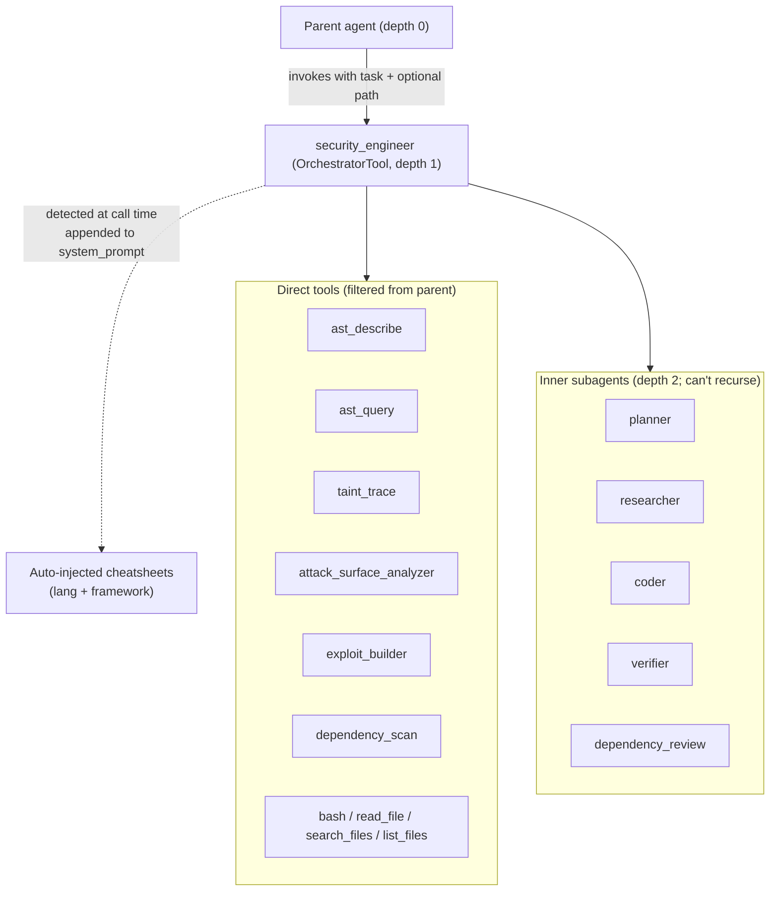

# Security Engineer Subagent

The `security_engineer` orchestrator is dyson's flagship subagent — a composable child agent that hunts reachable vulnerabilities in a target codebase using AST-aware tools, taint analysis, and parallel subagent dispatch.  This doc covers its architecture, the prompt techniques that make it work against production-scale (and production-weak) models, and the tuning loop for adapting it to new models.

Code pointers:

- [security_engineer.rs](../crates/dyson/src/skill/subagent/security_engineer.rs) — `security_engineer_config()` returns the `OrchestratorConfig`
- [security_engineer.md](../crates/dyson/src/skill/subagent/prompts/security_engineer.md) — the system prompt
- [security_engineer_protocol.md](../crates/dyson/src/skill/subagent/prompts/security_engineer_protocol.md) — the fragment injected into the parent's prompt (when-to-invoke guidance)
- [repo_detect.rs](../crates/dyson/src/skill/subagent/repo_detect.rs) — runtime cheatsheet detection
- [prompts/cheatsheets/](../crates/dyson/src/skill/subagent/prompts/cheatsheets/) — language + framework sheets

Related:

- [Subagents overview](subagents.md) — orchestrator framework + composition model
- [Testing](testing.md) — smoke/regression/live-review infrastructure

## Composition



On invocation:

1. Parent calls `security_engineer({ task, context?, path? })`.
2. `OrchestratorTool::run` canonicalises `path` to a scoped review root.
3. `repo_detect::detect_and_compose` shallow-parses manifests, returns cheatsheet markdown + the list of included sheet names (logged at INFO).
4. Cheatsheet body is concatenated onto the base `security_engineer.md` prompt; the child agent is spawned with the composed prompt.
5. Child runs up to 150 iterations / 8192 tokens per turn.  Inner subagents execute at depth 2, inheriting the orchestrator child's scoped `working_dir` (propagation fix in [`SubagentTool::run`](../crates/dyson/src/skill/subagent/mod.rs) — without it, `dependency_review` fell back to the process cwd and scanned stale checkouts from prior runs).  Only the child's final assistant text returns to the parent.

## Cheatsheet injection

Sheets live at [prompts/cheatsheets/{lang,framework}/*.md](../crates/dyson/src/skill/subagent/prompts/cheatsheets/) and ship via `include_str!` — no runtime I/O, no binary bloat beyond ~620 lines of static markdown.

### Detection

[repo_detect.rs](../crates/dyson/src/skill/subagent/repo_detect.rs) walks two passes from the scoped review root:

- **Up** 5 ancestor directories, non-recursive — handles `juice-shop/routes/` scoping where `package.json` sits one level up.
- **Down** 3 depth levels via `ignore::WalkBuilder`, which already respects `.gitignore` (with `require_git(false)` so it bites on bare tarballs too), `.git/info/exclude`, global gitignore, and hidden files.  A supplementary skip list covers `node_modules`, `target`, `.venv`, `venv`, `__pycache__`, `dist`, `build`, `vendor`, `.next`, `.cache` for repos shipped without a `.gitignore`.

Coverage matches every tree-sitter grammar dyson's `ast_query` supports (13 langs) plus PHP (no in-tree grammar; the sheet still guides `read_file` / `search_files` work).  Manifests recognised:

| Lang | Manifests |
|---|---|
| Rust | `Cargo.toml` |
| JavaScript / TypeScript | `package.json` |
| Python | `pyproject.toml`, `requirements*.txt` |
| Go | `go.mod` |
| Ruby | `Gemfile`, `Gemfile.lock` |
| Java / Kotlin | `pom.xml`, `build.gradle`, `build.gradle.kts` |
| C# / .NET | `*.csproj`, `*.fsproj`, `*.vbproj` |
| PHP | `composer.json`, `composer.lock` |
| C / C++ | `conanfile.txt`, `conanfile.py`, `CMakeLists.txt` |
| Elixir | `mix.exs`, `mix.lock` |
| Haskell | `stack.yaml`, `cabal.project` |
| Swift | `Package.swift` |
| OCaml | `dune-project` |
| Erlang | `rebar.config` |
| Zig | `build.zig`, `build.zig.zon` |
| Nix | `flake.nix`, `default.nix`, `shell.nix` |
| Lua | `*.rockspec` |

Framework detection shallow-parses dependency tables:

| Manifest | Dep name / coord | Sheet |
|---|---|---|
| `package.json` | `express` | `framework/express` |
| `package.json` | `next` | `framework/nextjs` |
| `package.json` | `fastify` | `framework/fastify` |
| `package.json` | `@nestjs/core` / `@nestjs/common` | `framework/nestjs` |
| `package.json` | `@trpc/server` | `framework/trpc` |
| `package.json` | `koa` | `framework/koa` |
| `package.json` | `hono` | `framework/hono` |
| `package.json` | `@sveltejs/kit` | `framework/sveltekit` |
| `package.json` | `@remix-run/*` | `framework/remix` |
| `package.json` | `@apollo/server` / `apollo-server` / `graphql-yoga` | `framework/graphql` |
| `package.json` | `@hapi/hapi` | `framework/hapi` |
| `package.json` | `@adonisjs/core` | `framework/adonis` |
| `package.json` | top-level `meteor` key or `meteor-node-stubs` | `framework/meteor` |
| `package.json` | `nuxt` | `framework/nuxt` |
| `pyproject.toml` / `requirements*.txt` | `django` | `framework/django` |
| `pyproject.toml` / `requirements*.txt` | `flask` | `framework/flask` |
| `pyproject.toml` / `requirements*.txt` | `fastapi` | `framework/fastapi` |
| `pyproject.toml` / `requirements*.txt` | `aiohttp` | `framework/aiohttp` |
| `pyproject.toml` / `requirements*.txt` | `tornado` | `framework/tornado` |
| `pyproject.toml` / `requirements*.txt` | `sanic` | `framework/sanic` |
| `pyproject.toml` / `requirements*.txt` | `celery` | `framework/celery` |
| `pyproject.toml` / `requirements*.txt` | `starlette` | `framework/starlette` |
| `pyproject.toml` / `requirements*.txt` | `pyramid` | `framework/pyramid` |
| `pyproject.toml` / `requirements*.txt` | `falcon` | `framework/falcon` |
| `pyproject.toml` / `requirements*.txt` | `bottle` | `framework/bottle` |
| `Cargo.toml` | `actix-web` / `actix` | `framework/actix` |
| `Cargo.toml` | `axum` | `framework/axum` |
| `Cargo.toml` | `rocket` | `framework/rocket` |
| `Cargo.toml` | `warp` | `framework/warp` |
| `Cargo.toml` | `tonic` | `framework/tonic` |
| `Gemfile` | `gem 'rails'` | `framework/rails` |
| `Gemfile` | `gem 'sinatra'` | `framework/sinatra` |
| `pom.xml` / `build.gradle` | `spring-boot-starter-*` / `org.springframework` | `framework/spring` |
| `pom.xml` / `build.gradle` | `io.quarkus` | `framework/quarkus` |
| `pom.xml` / `build.gradle` | `io.micronaut` | `framework/micronaut` |
| `pom.xml` / `build.gradle` | `io.javalin` | `framework/javalin` |
| `pom.xml` / `build.gradle` | `com.typesafe.play` / `play-java` / `play-scala` | `framework/play` |
| `pom.xml` / `build.gradle` | `io.dropwizard` | `framework/dropwizard` |
| `pom.xml` / `build.gradle` | `io.helidon` | `framework/helidon` |
| `pom.xml` / `build.gradle` | `io.vertx` | `framework/vertx` |
| `build.gradle.kts` | `io.ktor:ktor-*` | `framework/ktor` |
| `*.csproj` / `*.fsproj` | `Microsoft.AspNetCore` | `framework/aspnet` |
| `composer.json` | `laravel/framework` | `framework/laravel` |
| `composer.json` | `symfony/framework-bundle` | `framework/symfony` |
| `composer.json` | `slim/slim` | `framework/slim` |
| `composer.json` | `codeigniter4/framework` | `framework/codeigniter` |
| `mix.exs` | `{:phoenix, ...}` | `framework/phoenix` |
| `go.mod` | `github.com/gin-gonic/gin` | `framework/gin` |
| `go.mod` | `github.com/labstack/echo` | `framework/echo` |
| `go.mod` | `github.com/go-chi/chi` | `framework/chi` |
| `go.mod` | `github.com/gofiber/fiber` | `framework/fiber` |
| `go.mod` | `github.com/gorilla/mux` | `framework/gorilla-mux` |
| `Package.swift` | `vapor/vapor` | `framework/vapor` |
| `Package.swift` | `hummingbird-project/hummingbird` | `framework/hummingbird` |
| `*.cabal` | `servant` / `servant-server` | `framework/servant` |
| `dune` | `dream` | `framework/dream` |
| `rebar.config` | `{cowboy, ...}` | `framework/cowboy` |
| `*.rockspec` | `lua-resty-*` / `openresty` | `framework/openresty` |

`build.gradle.kts` (Kotlin DSL) registers the review as **Kotlin** (not Java); plain `build.gradle` and `pom.xml` stay Java.  Spring is flagged from either.

### Composition and cap

- Top 2 languages by manifest count (ties broken by the enum order for reproducibility).
- Frameworks bound to selected languages only.
- Hard cap of 400 lines on the composed body.  If over: drop frameworks first, then the second language.  Single-language sheets are bounded at ~100 lines, so one sheet always fits.

### Why inline, not a runtime tool

The sheets are guidance the agent needs from turn 1.  A tool-driven lookup wastes a turn and biases the model against reading them ("optional, skip it").  Inline injection is free when no manifests match and cheap when they do.

### Env toggle

`DYSON_SECURITY_ENGINEER_CHEATSHEETS=off` (also `false`, `0`, `no`) disables injection at call time.  Used by `expensive_live_security_review --cheatsheets off` for A/B tuning work.  Default: on.

### Sheet content rules

Each sheet opens with:

> Starting points for `<lang/framework>` — not exhaustive.  Novel sinks outside this list are still in scope.

This is **non-negotiable**.  Without it the model anchors on the sheet and misses unlisted patterns.

Sheets are 50–100 lines each and carry:

- Concrete sink API names with version-relevant gotchas (e.g. `js-yaml` pre-4.0 `yaml.load`)
- Tree-sitter S-expression query seeds
- Framework-specific source→sink chains (e.g. `req.body` → operator injection via Mongoose `.find(req.body)`)
- Forbidden dismissal phrasings specific to the class

Prose explaining what SSRF / XSS / etc. *are* does NOT belong in sheets — the base prompt handles vuln theory.  Sheets must pay in both capability and token cost.

## Prompt techniques

All of these come from the [case study](#case-study-tuning-for-qwen36-plus) below.  Each addresses a specific failure mode observed against weaker production models.  The techniques generalise — the principle is that weaker models pattern-match on concrete surface forms more reliably than on abstractions.

### 1. Concrete negative examples beat abstract rules

A weaker model ignores "no preamble" and cheerfully writes "Let me now compile the final report."  It respects a bulleted list of the exact forbidden phrases.

The prompt carries four such lists, each backed by real sentences from prior runs:

| Rule | Guards against | Example forbidden phrase |
|---|---|---|
| Forbidden opening phrases | Preamble | "Now I have comprehensive understanding…" |
| Preamble-shape pattern | Paraphrased preambles | Any sentence starting with `Now`/`Let me`/`I have`/`Here`/`Based on`/`The <X> is complete` before the first `#` |
| Forbidden report structures | Progress-memo / summary lists | `### 1. What I have accomplished so far` |
| Forbidden dismissal phrases | Weak not-a-finding justifications | "property names come from the serialized structure" |
| Forbidden downgrade phrasings | Coincidental-guard demotions | "`new Map(arg)` requires an iterable" |

When a new failure mode shows up in a tuning run, capture the exact sentence verbatim, add it to the appropriate list, rerun.

### 2. Forbidden report structures

Separate from preamble: a "progress update" isn't prose preceding the report, it IS the whole response.  The prompt bans specific shapes:

- `### 1. What I have accomplished so far` / `### 2. What still needs to be done` / `### 3. Relevant partial results` — a status memo, not a report.
- Numbered lists of findings (`1. CRITICAL: SQLi...`, `2. CRITICAL: pickle...`) that lack per-finding blocks.
- "Stopped due to iteration limit" / "Stopped to stay within budget" prose — never mention the budget in the report.

With the fallback: a **minimal schema-compliant report** (one CRITICAL finding in full schema + empty "No findings." sections) always beats a summary memo.

### 3. Anti-fabrication: the transcript is the only ground truth

A model under pressure will invent a `Taint Trace:` block that looks authoritative.  Two defences:

**Scale tell.** Real taint indexes a whole language subtree: `files=20+, calls=500+` typical.  A block with `files=1 calls=1` is a one-file sanity check, not a realistic trace — fabrication-adjacent.

**Structural tell.** Real `taint_trace` output always contains ALL of: `defs=` and `unresolved_callees=` fields, a `Found N candidate path(s) from X to Y:` header, `[byte A-B]` byte ranges on every hop, a `[SINK REACHED] — tainted at sink:` terminal marker.  Missing any one = fabricated.

**But hitting all four markers still doesn't prove it's real.**  A sophisticated fabrication will pass all four.  The only ground truth is whether `taint_trace` was invoked this session.  Pre-Submit Check #13 requires walking the transcript: count real `taint_trace` calls; if `Taint Trace:` blocks in the report exceed that count, some are fabricated.

### 4. Budget-out fallback

When budget prevents running `taint_trace`, the correct move is NOT to:

- Fabricate a block (integrity failure)
- Downgrade to MEDIUM silently (finding loss)
- Switch to a progress memo ("didn't finish")

It IS:

```
Taint Trace: not run within budget — same-line / structural evidence only
```

…with the Impact line carrying the source→sink chain as prose.  A CRITICAL with an honest "not run" disclaimer beats a fabricated block OR a degraded memo every time.

### 5. Coincidental guards do not downgrade past MEDIUM

When a prototype-walk primitive exists with no blocklist, the finding ships CRITICAL even if current downstream type checks happen to block exploitation (`new X(arg)` rejects non-iterables, an `id` field is `undefined` so a lookup fails).  Those guards are accidental unless a comment names the threat or a regression test pins the behavior.

The prompt carries five concrete forbidden phrasings (captured from real runs) that the model uses to justify coincidental-guard downgrades:

- "walk results are passed through type-coercive constructors (Map, Set)"
- "`new Map(arg)` requires an iterable"
- "No concrete exploit path was found that bypasses these type checks"
- "downstream consumers gate against the server manifest"
- "walk is passed to an identity function / typed constructor"

The correct Impact rewrite: `"primitive is coincidentally mitigated by <specific guard>, but the primitive remains and a refactor adding <plausible change> flips it to live RCE"`.

### 6. Wire-format parsers are a #1 silent-skip RCE class

Any function that switches on tag bytes from a request body, or walks a property chain from a user-supplied string, is a high-priority sink.  The wire format IS the attacker — every byte in a body, header, FormData entry, or stream is attacker-controlled.

An unchecked property-chain walk over wire-derived segments is a **prototype-walk primitive**: segments landing on `constructor`, `__proto__`, `prototype` yield `Function` and indirect `eval` in JS.  Equivalents: Python `getattr` chains, Ruby `send`, Java reflection on user-named methods, Go `reflect.Value.FieldByName`.

The JS/TS cheatsheet ships with the canonical silhouette of this bug class, so the model can pattern-match against it in unfamiliar codebases:

```
const path = reference.split(':');
let value = chunks[parseInt(path[0])];
for (let i = 1; i < path.length; i++) {
  value = value[path[i]];             // <-- the primitive
}
```

### 7. Per-finding penalties beat whole-report penalties

A hard "entire report capped at X if Y" triggers premature termination — the model shortens its report instead of recovering.  Demoting **specific findings** that fail a check leaves the rest of the output intact.

Examples in the prompt:

- `CRITICAL/HIGH without verbatim taint_trace output inline` → demote **that finding** to MEDIUM
- A finding whose `ast_query` match is missing from the session → demote **that finding** to MEDIUM
- Missing `Impact:` line → **that finding** doesn't ship

Report-wide caps caused a documented regression in the earlier case study (docs/testing.md, iter3 → iter4).  Don't reintroduce them.

### 8. "Paste real output required" and "invent output forbidden" are TWO rules

Weaker models collapse these into a single "don't mention tool output" directive, which silently deletes required evidence.  The prompt states them explicitly as separate rules, each with its own enforcement text — and an "Obvious-vulnerability escape hatch" clarifying that even for an obvious `eval(req.body.x)`, the fix is to **run `taint_trace` same-line**, not to skip the block.

### 9. Budget awareness

Budget awareness is written as a behaviour rule, not an assertion of the underlying `max_iterations`:

> You have a generous iteration budget (~150 tool-calling turns).  Treat turn 140 as your "must start writing the report" line: by then, every remaining turn is either for verification of an already-identified finding or for the final write-up, NOT for "one more check" or new exploration.  Every tool call past ~148 trades a complete report for a `[Response interrupted by a tool use result]` stub.

Raised from 40 to 150 after repeated budget-outs on deep-chain CVE targets (see the iter4-9 case study below).  Pair with the Section 2 "minimal schema-compliant report" fallback so the model has a safe default when the budget feels tight even with the generous limit.

### 10. Concern-scoped reviews

Pattern that emerged in the iter4-9 sweep: the agent finds more when `sub:` narrows to the subsystem where the bug lives, rather than the project root.  The difference is not that the agent can't search a larger surface — it's that the per-finding verification cost (ast_query → taint_trace → read_file → file it) scales with the count of plausible sinks.  A narrower scope produces fewer false candidates, so more budget goes to verifying the real ones.

Working pattern:

- Protocol handler (e.g. `java/org/apache/coyote/ajp` for Tomcat AJP bugs)
- Path matcher (e.g. `.../security/web/util/matcher` for request-matcher bypasses)
- Admin resources (e.g. `services/resources/admin` for authorization audits)
- Flight / RSC protocol core (`packages/react-server/src` for prototype-walk primitives)
- Deserialization tree (`.../jackson/databind/deser` for polymorphic-deser bugs)

Anti-pattern: scoping to a wrapper package that delegates to a sibling for the unsafe op.  See case study below for the `react-server-dom-webpack` vs. `react-server` pair: same agent, same prompt, different `sub` — hit vs. six-attempt miss.

### 11. Class-level vulnerability rules (cheatsheet sections)

Rules that surface a *class* of bug, not a specific CVE.  Each was added to the cheatsheets after a hints-off miss and tested against fresh targets to confirm it doesn't overfit.  Language-independent framings where possible:

| Rule | Cheatsheet | Shape it teaches |
|---|---|---|
| **Scope-delegation dismissal is NOT a mitigation** | all langs | Wrapper in scope receiving attacker input → unsafe op in sibling package.  File at the wrapper; cite the delegation call site as the sink; describe the downstream op in Impact. |
| **Reviewing a serialization library itself** | java | Public read API (`readValue`/`load`/`parse`) is the entry, not the sink.  Sink is any internal method that turns a wire-format string into a `Class<?>` / `Constructor<?>` / `Method`. |
| **Property-path reflection walk** | java | Dotted user path traversing introspected getter chains reaches reflection primitives.  BLOCKLIST of property names means the walk is known-reachable; any reachable reflection-returning getter not on it is a finding. |
| **Trust-boundary internal headers** | javascript | Runtime internal header (`x-*-subrequest`, `x-origin-verified`, `x-admin-override`) read from untrusted network input without provenance check → middleware / auth bypass. |
| **Wire-format / RSC prototype-walk silhouette** | javascript | `path.split(sep)` → `value = value[path[i]]` loop fed from request body.  Segments on `constructor`/`__proto__`/`prototype` give `Function` indirectly — no explicit `eval` required. |

The *generalisability discipline* is as important as the content: every rule above was de-fit after its first draft to strip named classes from specific CVEs.  A rule that names `CachedIntrospectionResults` will pattern-match Spring4Shell; a rule that names "blocklist of property names returning reflection primitives" will find novel variants too.

## Output schema

```
## CRITICAL
### <one-line finding title>
- **File:** `path/to/file.ext:LINE`
- **Evidence:** ```<exact text at the cited line>```
- **Attack Tree:**
  <entry file:line> — <external entry>
    └─ <hop file:line> — <what this hop does>
      └─ <sink file:line> — <unsafe operation>
- **Taint Trace:** (verbatim tool output OR "not run within budget" disclaimer)
- **Impact:** <concrete outcome — no "may"/"could"/"might">
- **Exploit:** <one payload; required for eval/exec/SQL/deser/SSTI/redirect>
- **Remediation:** <specific fix with corrected snippet>
```

Repeat for `## HIGH`, `## MEDIUM`, `## LOW / INFORMATIONAL`.  Completeness rule: **every report has all seven sections**.  If a section has no findings, write the header followed by `No findings.` on its own line — do not silently skip.

Then: `## Checked and Cleared`, `## Dependencies`, `## Remediation Summary`.

A Pre-Submit Check runs before the report ships — see [security_engineer.md](../crates/dyson/src/skill/subagent/prompts/security_engineer.md) for the full checklist.

## Evaluating report quality

Signals on a live report:

- **Attack Tree depth.** Non-trivial findings carry 2–3 resolved hops.  Single-hop trees above MEDIUM mean `taint_trace` was skipped or fed weak sources/sinks.
- **`resolved_hops / total_hops` per trace.** Consistent `1/2` or `0/1` means `ast_query` wasn't run first to find real sources and sinks.
- **`UnresolvedCallee` rate.** Baselines from `examples/smoke_taint_trace.rs`: 0–2% imperative languages, ~25% Haskell (typeclasses), ~30% Nix (attribute paths).  A spike on a supported language = `flatten_callee` bug → minimise to a fixture, add a regression test in `tests/ast_taint_patterns.rs`.
- **`[TRUNCATED]` in the index header.** Repo exceeded `TAINT_MAX_FILES = 5000`; bump the constant in `src/ast/taint/index.rs`.
- **"Checked and Cleared" on expected-vulnerable code.** Usually `taint_trace` is returning NO_PATH when it shouldn't — wrong source line or a non-tier-1 language missing assignment propagation.
- **Fabrication scan.** `grep -c "taint_trace: lossy" report.md` should equal the number of real `taint_trace` tool calls in the run's log.
- **Preamble scan.** First non-whitespace char of the report should be `#`.

## The tuning loop

Per [docs/testing.md](testing.md), `expensive_live_security_review` supports a **run → grade → tune → run** loop.  Signals to track:

- Tool usage mix (grep `tool call started` out of the log; count by tool name)
- Fabricated output (structural + scale tells; cross-check against transcript)
- Report structure (all 7 sections? `Impact:` on every finding?)
- Response leakage (preamble? trailing summary?)
- Finding accuracy (known-vulnerable repos give ground truth)

```bash
# Single target, distinct output
cargo run -p dyson --example expensive_live_security_review --release -- \
    --config dyson.json --target juice-shop --report-suffix iter1

# A/B cheatsheet injection
cargo run -p dyson --example expensive_live_security_review --release -- \
    --config dyson.json --target pygoat --cheatsheets off --report-suffix iter1-off

# Pin to a version for CVE repro
cargo run -p dyson --example expensive_live_security_review --release -- \
    --config dyson.json --target react-server-19.2.0 --ref v19.2.0
```

Tool-call histogram from a log:

```bash
grep 'tool call started' /tmp/dyson-live-<target>-<iter>.log \
  | grep -oE '"[a-z_]+"' | sort | uniq -c | sort -rn
```

Prompt tunes **do not get regression tests** — LLM outputs are non-deterministic, and a test asserting "a tool was called" is too weak to be useful.  The iteration transcript (logs + reports under distinct suffixes) is the test artifact.

Code changes discovered in the loop (e.g. `OrchestratorTool.path`, `CaptureOutput` multi-turn fix) DO get unit tests in `src/skill/subagent/tests.rs`.

## Case study: tuning for qwen3.6-plus

OpenRouter's qwen3.6-plus is ~10× cheaper than Opus and ~60% smaller.  It fails in distinct ways: preambles ("Let me now compile…"), progress-update memos instead of reports, fabricated `Taint Trace:` blocks with plausible-looking markers, coincidental-guard downgrades.  The tuning loop against pygoat (Django) and react-server-19.2.0 (Node/RSC) drove prompt iter1 → iter3.

| Iter | Tune | Effect |
|---|---|---|
| 0 (baseline) | Prompt tuned against Claude; cheatsheet injection added | pygoat found 3 obvious CRITICALs; react-server missed the ReactFlight `:614` prototype-walk entirely on wrong-subpath runs |
| 1 (post-fix) | Added JS cheatsheet RSC/RPC wire-format silhouette + "Required evidence" clause; switched target to `packages/react-server/src` where the bug lives; fixed `CaptureOutput` multi-turn text loss | Pygoat-off: clean 21k report, 6 real traces.  Pygoat-on: preamble trap (1.5k).  React-server-on: found `:614` + `:564` correctly but emitted a progress-update memo instead of the schema.  React-server-off: found `:614` but dismissed with "server is the sole generator" (forbidden phrase). |
| 2 | Added "Forbidden report structures" section (progress-memo + numbered-summary bans); added "server is sole generator" / "server-emitted references" to forbidden dismissal list; softened cheatsheet "Required evidence" → "Preferred evidence" (was blocking findings instead of shipping them) | React-server-on: proper schema report, found `:614`, used "Unverified — taint_trace not run within budget" disclaimer — exactly the new fallback pattern.  React-server-off: **fabricated a Taint Trace block with all four structural markers** and demoted `:614` using "new Map(arg) requires an iterable" (the coincidental-guard violation).  Pygoat-on: 9k, 5/7 sections.  Pygoat-off: regressed to preamble+numbered-summary memo. |
| 3 | Added five concrete forbidden downgrade phrasings (captured verbatim from iter2 off); added "Hitting all four structural markers does NOT prove a block is real — walk the transcript" anti-fabrication rule; moved budget-out disclaimer from JS cheatsheet to main prompt (universal, applies with cheatsheets OFF too) | React-server-off: found `:614` + `:565`, explicitly honored coincidental-guard rule with correct "accidental guards, one refactor flips it" rewrite.  React-server-on: full schema + disclaimer.  Pygoat-on: **31.9k, 7/7 sections, 15 real taint_trace calls, 0 fabrication** — the best single run.  Pygoat-off: 16k, 6/7, no fabrication. |

Lessons that generalise:

- **Concrete negative examples beat abstract rules.**  Every iter3 tune was a verbatim phrase captured from a failing iter2 run.
- **Per-finding penalties beat report-wide ones.**  Report-wide caps (docs/testing.md iter3 → iter4) cause premature termination.
- **Separate "must paste real output" from "must not invent output".**  Collapsing them silently deletes evidence.
- **Sophisticated fabrication passes naive structural checks.**  Ground truth is the tool-call transcript.
- **Give the model an honest escape hatch.**  When budget prevents `taint_trace`, a `not run within budget` disclaimer beats invention AND beats degrading to a memo.
- **Some ceilings are model limits.**  Even after three iterations, qwen3.6-plus occasionally falls back to `search_files`/`bash grep` over `ast_query` on familiar-looking grep targets.  Know when to stop tuning.

## Case study: CVE-repro sweep and the scope-delegation rule

Where the qwen3.6-plus case study above was about *structural* report failures (preamble, fabrication, memo-instead-of-report), this one is about *analytic* failures on targets where the vulnerable code is physically separated from the user-facing wrapper — a failure mode that only shows up when you run against real published CVEs instead of teaching repos.

The target set for this iteration is the nine CVE-repro entries in [expensive_live_security_review.rs](../crates/dyson/examples/expensive_live_security_review.rs) (log4j 2.14.1, spring-beans 5.3.17, jackson-databind 2.12.6, lodash 4.17.11, ejs 3.1.6, pyyaml 5.3, nextjs 14.0.0, rails 6.0.4.7, django 3.2.14) plus three React 19.2.0 subpackages including `react-server-dom-webpack/src` (the React2Shell / CVE-2025-55182 surface).  These differ from the OWASP teaching targets in one important way: the bug is in library code, and the vulnerable sink is often a few `import`s away from the user-facing wrapper the agent is scoped to.  That physical separation is what triggered the regression.

### Methodology

Same run → grade → tune → run loop as the qwen tuning, but with one addition: **per-target verdicts** against a rubric of Hit / Near-miss / Miss + fabrication / Miss + preamble / Tool-mix regression.  A "Hit" requires the CRITICAL finding's `File:` line to be the documented CVE path (or within 5 lines).  A "Near-miss" is right-file-wrong-severity OR the dismissal arm mentions the pattern but the agent doesn't file it.  The rubric runs as a shell one-liner post-sweep:

```bash
for t in <targets>; do
  log=test-output/iterN/dyson-live-$t.log
  rpt=test-output/iterN/dyson-security-review-$t-iterN.md
  grep 'tool call started' "$log" | grep -oE '"[a-z_]+"' | sort | uniq -c | sort -rn
  real=$(grep -c 'tool call finished.*taint_trace' "$log")
  blocks=$(grep -c 'taint_trace: lossy' "$rpt")
  echo "$t: taint_trace real=$real blocks_in_report=$blocks"
done
```

`real ≥ blocks` across every target = zero fabrication.  `real < blocks` on any target = fabrication; go look.

### iter1: baseline sweep

Ran four targets 4×-parallel against the current prompt + cheatsheets.  Outcomes:

| Target | Verdict | Notes |
|---|---|---|
| log4j-2.14.1 | **Hit** | `JndiManager.java:172` — full Log4Shell chain, 3 real traces, one inlined |
| pyyaml-5.3 | **Hit** | `constructor.py:698` — CVE-2020-1747 FullLoader RCE, depth-4 trace |
| nextjs-14.0.0 | **Hit** (different CVE) | `sandbox/sandbox.ts:83` — CVE-2025-29927 middleware subrequest bypass (not the CVE the target was originally staged for, but a legitimate pre-auth bypass in scope) |
| react-server-dom-webpack-19.2.0 | **Near-miss + preamble + tool-mix regression** | 0 `taint_trace` calls (deep-chain target); preamble "I have a complete picture now"; dismissed `decodeReply` to Checked and Cleared with "sink lives in another package" |

Fabrication across all four: clean.  The React2Shell miss was the signal finding.

### The scope-delegation dismissal

The React2Shell agent correctly identified `decodeReply` in `server/ReactFlightDOMServerNode.js` as receiving attacker input (a `FormData` POST body), correctly identified that `decodeReply` delegates to `createResponse` → `resolveField` in `react-server/src/ReactFlightReplyServer.js`, and then **moved the finding to Checked and Cleared with the reason "outside this review scope"**.  That reason never clears a finding.  `decodeReply` is the attacker's API over the wire; the fact that the unsafe op is one `import` away is a call-graph observation, not a mitigation.

Existing prompt rules didn't catch this.  The anti-preamble rule is triggered; the forbidden-downgrade-phrasings list is triggered for a different shape (coincidental guards, type-coercive constructors); the wire-format-class dismissal list is triggered for "path segments are numeric" and "value is bound" — none of those are "sink is in a sibling package".  The gap was a new dismissal pattern.

### iter2: add scope-delegation rule to cheatsheets

Tune: added a "Scope-delegation dismissal — NOT a mitigation" section to `cheatsheets/lang/javascript.md`, `java.md`, and `python.md`.  Phrased generically — any wrapper-to-sibling-package pattern — rather than naming React specifically.  The rule tells the model:

1. File at the wrapper's exported entry, not at the out-of-scope sink.
2. Cite the delegation call site as the sink line.
3. Describe the downstream unsafe op in Impact.
4. Do not move the wrapper to Checked and Cleared with an "outside scope" reason.

Also added a Java-specific hint for polymorphic deser gadget-chain wrappers (BeanDeserializer, AsPropertyTypeDeserializer, TypeIdResolver) because that chain has a well-known silhouette that the generic rule doesn't surface.

Reran: react-server-dom-webpack, jackson-databind-2.12.6 (tests the new Java rule on a deep chain), ejs-3.1.6 (tests we don't regress on shallow cases).

| Target | Verdict | Notes |
|---|---|---|
| react-server-dom-webpack (retry) | **Still near-miss**, preamble fixed | Rule didn't fire.  Filed MEDIUM info-disclosure + LOW fail-open + LOW CWD scan; moved `decodeReply` to Checked and Cleared again with "core Flight parsing lives in `react-server/src`".  0 `taint_trace`. |
| jackson-databind-2.12.6 | **Hit + preamble regression** | Correct CRITICAL on `StdTypeResolverBuilder.java:141` with full `Class.forName` → gadget chain.  Rule activated.  But opened with "Now I have a comprehensive understanding…" — verbatim banned phrase. |
| ejs-3.1.6 | **Hit + fabrication** | Correct CVE-2022-29078 at `lib/ejs.js:590`.  **Two `Taint Trace:` blocks in the report, zero `taint_trace` calls in the log.**  Blocks pass all four structural markers. |

Clear partial win.  Java rule worked on jackson; JS rule didn't fire on react.  Diagnosis: the scope-delegation rule was a sub-bullet *inside* the wire-format subsection — the model only consulted it when it was already in "wire-format finding" mode.  For react-server-dom-webpack, the agent concluded early that the package is a thin wrapper (build-time plugin + runtime re-exports) and never entered wire-format mode.

### iter3: promote the rule to a top-level section

Tune: pulled the scope-delegation rule out of the wire-format subsection and made it a peer of `## Sinks` / `## Tree-sitter seeds` in each language cheatsheet.  Header: `## Scope-delegation dismissal — NOT a mitigation`.  Opens with "Applies to every sink class above, not just RSC / wire-format."  Phrases-to-reject list expanded with "this file just re-exports / delegates to X", "wraps Y which is outside this review", "the sink is in the runtime / framework core".  Also expanded the Java rule beyond polymorphic deser to cover reflection / SQL / template / XXE / command exec wrappers.

Not a rewrite of the prompt — a promotion of existing content from bullet depth 2 to section depth 0.  Total delta across three cheatsheets: ~40 added lines, ~5 removed (consolidation).

Third-attempt results on react-server-dom-webpack: **worse**.  Filed zero findings (iter2 had filed MEDIUM+LOW).  The agent routed around the promoted rule's banned phrases by rewording the same dismissal as *"passes body to createResponse (out of scope). No transformation."* — semantically identical, structurally novel, filed under Checked and Cleared.  Reverted the JS promotion the same day; kept Java and Python promoted where they worked cleanly.

Lesson: **a rule catches reasoning but not rewording.**  Banning specific phrases gives the model permission to use adjacent phrases.  The fix is either (a) a structural test on the Checked-and-Cleared reason shape (if the reason is "function hands its argument to another function", it's a finding, not a clear) or (b) accept model limits on this specific pattern.  See iter4-9 case study for the eventual resolution: when scope points at the package that actually contains the sink rather than the delegating wrapper, the same agent finds the bug in one attempt.

### Lessons so far

- **Deep-chain CVE targets expose failure modes that teaching repos don't.**  Pygoat/Juice Shop SQLi lives one line from the handler entry — there's no chance to "lose the trail" between wrapper and sink.  Real library code puts 2-4 file boundaries between them, and the agent interprets each boundary as a scope boundary.
- **Rule depth matters.**  A rule buried as a sub-bullet under a subsection only fires when the model is already in that subsection's frame.  Rules that should apply across all sink classes belong at section depth 0 with an explicit "applies to every sink class" prefix.
- **Phrasing the rule generically is worth the effort even when you're fixing one specific miss.**  The iter2 Java rule (which is generic) caught jackson on the first run of iter2.  The iter2 JS rule (which mentioned `react-server` / `react-client` as example callees) didn't catch react, because the agent's dismissal phrased the callee differently.  Examples hurt when they let the model pattern-match a miss as "not this one, that was a different import path".  iter3 removes the specific package names from the phrases-to-reject list and keeps only structural phrasings ("delegates to X", "wraps Y").
- **The scope-delegation rule doesn't help with fabrication or preamble.**  Those are orthogonal failures.  ejs iter2 fabricated even though the scope-delegation rule was present; the two issues don't share a root cause.  A tuning round should expect to surface new unrelated failures, not fix them all.
- **"Don't overfit to the failure case" is real.**  The first iter2 draft (before the user pushed back) wanted to name `decodeReply` / `ReactFlightReplyServer` / `createResponse` as specific wrappers-to-file.  That would have helped react at the cost of not generalising.  The generic rule is weaker on the original case but applies to jackson, spring, and anything else that follows the wrapper-to-sibling-package shape.

Sample reports from each iter (including both hits and the ongoing react miss) live under [docs/sample-seceng-reports/](sample-seceng-reports/).

## Case study: iter4-9 — hints-off baseline, 150-turn budget, concern-scoped targets

The first two case studies tuned against a narrow target set with hints-on (target `description` including the CVE number and vulnerable API name fed into the agent's `context`).  iter4 onwards removed that spoiler, raised the budget, and diversified the target list to cover real OSS web applications across four language stacks.  The goal was a baseline for *independent rediscovery*: can the agent find the bug without being told where to look?

### Infrastructure changes

- **`--hints off` as default** ([expensive_live_security_review.rs](../crates/dyson/examples/expensive_live_security_review.rs)).  Target now carries two fields: a spoiler-laden `description` (the CVE number + vulnerable API — used when `--hints on`) and a neutral `summary` ("Apache Log4j — Java logging library").  Default sends only the summary.  Every sample report in [docs/sample-seceng-reports/](sample-seceng-reports/) was produced under this regime — findings are independent rediscoveries.
- **Iteration budget 40 → 150** ([security_engineer.rs](../crates/dyson/src/skill/subagent/security_engineer.rs)).  iter5 jackson-databind budgeted out in preamble at 40; iter6 spring-beans hit Spring4Shell analytically but ran out during the write phase and bailed into a progress-memo.  Budget cap was the bottleneck, not analysis.
- **`SubagentTool` scoped-path propagation fix** ([mod.rs](../crates/dyson/src/skill/subagent/mod.rs)).  Previously `SubagentTool::run` passed `working_dir: None` to `spawn_child` regardless of the caller's context, so every inner subagent (`dependency_review`, `researcher`, `verifier`) fell back to the process cwd.  Visible failure: iter1 next.js review produced a Dependencies section listing juice-shop findings because a stale juice-shop clone was the only lockfile the dep scanner could reach.  Regression test `subagent_inherits_parents_working_dir` pins the fix.
- **`--output-dir` flag** for reports, defaulting to `test-output/` (gitignored).  Previous hardcoded `/tmp` made iteration artifacts hard to organise across runs.

### Target set diversification

Starting set covered library-internal Java / JS / Python CVE-repros.  Added:

- **Real OSS web applications.** Ghost 5.59.0 (Node/Express CMS, file upload + SSRF), Mastodon 4.0.2 (Ruby/Rails social, HTML sanitisation), Gitea 1.17.3 (Go/Chi Git host, SVG SSRF), Strapi 4.4.5 (Node/Koa headless CMS, webhook SSRF), Airflow 2.4.0 (Python/Flask orchestrator, stored XSS), Grafana 9.3.6 (Go observability, stored XSS), Keycloak 22.0.0 (Java/Quarkus IAM, admin XSS).  Each exercises a different framework cheatsheet.
- **Fresh CVE-repro libraries** the cheatsheets had never seen: commons-text 1.9 (Java Text4Shell), minimist 1.2.5 (Node proto-pollution), urllib3 1.26.14 (Python cookie-on-redirect), Tomcat 9.0.30 (Java Ghostcat AJP), Spring Security 5.6.2 (regex auth bypass), node-forge 1.2.1 (RSA sig verify bypass).

Five framework cheatsheets that had never seen a live run (Koa, Quarkus, Flask, Chi, Rails) were exercised for the first time.

### Verdict tally (iter7 + iter8 + iter9, hints off)

| Verdict | Count | Representative |
|---|---|---|
| **Hit** (CVE pinned or multiple real findings) | 10 | log4j (Log4Shell), jackson-databind (SubTypeValidator), nextjs (middleware bypass), pyyaml (5 FullLoader sinks), lodash (proto-pollution), commons-text (Text4Shell), webgoat (ORDER BY SQLi), ghost (4 bugs: SQLi + 2 no-auth uploads + open redirect), strapi (CVE-2023-22894 + JWT bypass + 3 more), react-server (React2Shell prototype-walk) |
| **Partial hit** (adjacent real finding, not exact CVE) | 4 | spring-beans (ClassEditor vs Spring4Shell), mastodon (LinkDetails iframe vs formatter), keycloak (testSMTPConnection missing-auth + stack trace leak), airflow (4 webserver-hardening findings) |
| **Near-miss** (right code examined, safe-looking reasoning) | 2 | django (Trunc/Extract regex rationale), spring-security (RegexRequestMatcher dismissed as developer-controlled) |
| **Miss** | 2 | react-server-dom-webpack (wrapper dismissal, 7 attempts), gitea (filed HTML-attr MEDIUM, missed SVG SSRF) |
| **API flake** (OpenRouter malformed response, not dyson) | 5+ | pyyaml iter5 flake then iter7 success, ejs 3 flakes in a row, jackson iter8 de-fit truncation, urllib3 iter8 truncated after correctly identifying CVE-2023-43804 |

Fabrication across the set: 1 incident (ejs iter2 inlined 2 `Taint Trace:` blocks with 0 real calls).  Every other report had `blocks ≤ real`.

### The scope-delegation resolution

iter1 → iter3 spent three rounds trying to get `react-server-dom-webpack` to file CVE-2025-55182.  iter5 retry failed again.  iter7 pointed the scope at the package that actually contains the sink (`packages/react-server/src`) rather than the wrapper that delegates to it (`packages/react-server-dom-webpack/src`).  Result: clean HIT, multiple findings, 24.9KB report listing prototype-walk in `getOutlinedModel`, same primitive in `createModelResolver`, `JSON.parse` on unvalidated `FormData`, `bindArgs` on attacker-controlled args.

The fix that worked was not a prompt tune.  It was scoping to where the bug lives.  The scope-delegation rule still ships because it helps on less-extreme cases (the Java rule worked cleanly on jackson and commons-text), but the React-family path showed a cheatsheet rule can't fully substitute for choosing scope correctly.

### The overfit audit

Three spots crept in during the cheatsheet tuning.  Called out + fixed:

1. **`x-middleware-subrequest` in the JS trust-boundary-header rule.**  User call: keep it.  That header pattern is a class of vulnerability across frameworks, not a CVE-specific string.  The rule lists it alongside generic placeholders.
2. **Jackson-specific terms in the Java deser rule** (`typeFromId`, `TypeIdResolver`).  Stripped — replaced with *"any internal method that takes a `String` off the parse path and returns a `Class<?>` / `Constructor<?>` / `Method` / `MethodHandle`"* + JVM primitives (`Class.forName` / `ClassLoader.loadClass`).  Validated: commons-text iter8 (fresh target, never mentioned in the cheatsheet) still found Text4Shell cleanly.
3. **React-specific example paths in the JS scope-delegation rule** (`../react-server/...`, `../react-client/...`).  Stripped.

Rule of thumb confirmed: after every prompt/cheatsheet tune, read the added lines aloud and ask "does this name a specific library or a class of bug?"  If it names a library, strip it.

### Lessons

- **Hints leak is load-bearing in "independent rediscovery" claims.**  Prior samples that looked like wins (log4j iter1 HIT) were real *but* the `description` fed the CVE number into the prompt.  The hints-off baseline is the first set where every sample is a defensible rediscovery.
- **Budget matters more than rules for deep-chain targets.**  40 → 150 flipped jackson from budget-out to HIT and spring-beans from progress-memo to schema-compliant.  No cheatsheet change could have fixed those cases; they needed write-the-report budget.
- **Scope is the unsung hero.**  The same agent with the same prompt gets different verdicts purely on `sub:` choice.  Scoping to a concern (protocol handler, path matcher, admin resources) surfaces more findings than scoping to a package root, because per-candidate verification cost is the binding constraint.
- **Framework cheatsheet coverage pays off on first contact.**  Five cheatsheets exercised for the first time (Koa, Quarkus, Flask, Chi, Rails) yielded 3 hits + 2 partial-hits with no tuning — the sheets had been written in advance against generic framework surface and held up.
- **API flakes are a separate risk class.**  5+ truncations this session.  Pure provider-side, not dyson.  Worth tracking but not a dyson engineering problem until the provider is stable.

Full sample set: [docs/sample-seceng-reports/](sample-seceng-reports/) (15 reports, hints off, mix of hit / partial / near-miss / miss across Java / JS / Python / Ruby / Go).

## When to use

- Security review of a directory or module (scope via the `path` input)
- Pre-release vulnerability sweep against a pinned version (via `--ref`)
- After completing non-trivial changes to auth/crypto/request-handling code — invoke from the parent agent as a validation step (see [security_engineer_protocol.md](../crates/dyson/src/skill/subagent/prompts/security_engineer_protocol.md))
- Reproducing a published CVE against a specific release

## When not to use

- General code review, style review, architecture review — use `researcher` / `verifier` instead
- One-off search for a specific line — direct `search_files` / `ast_query` from the parent is cheaper
- A codebase where the attack surface lives entirely outside the scope you can pass in `path` — the orchestrator canonicalises `path` and scopes its child agent there; `..` lookups won't reach out

## Follow-ups

Known limits worth tracking:

- **`taint_trace` defaults.**  Per-call `max_depth=16` / `max_paths=10` (bumped from 8/5 during the qwen case study's iter3 follow-up — the RSC chain `FormData → resolveField → getChunk → JSON.parse → reviveModel → parseModelString → getOutlinedModel → walk` is 8 hops on its own).  For deeper classes (polymorphic deser, reflection-heavy dispatch, bean-binding walks) pass explicit `max_depth: 32, max_paths: 20` from the per-call input rather than bumping defaults further.  The Java deser cheatsheet rule already nudges the model there.
- **Up-walk for scoped settings.**  Pygoat-style polyglot targets (settings.py outside `introduction/` scope) can leave secrets invisible to the scoped child.  An `up_walk: N` input on `OrchestratorTool` would let a caller widen the scope for settings-file reads without changing `working_dir`.  Not implemented.
- **Fabrication defence is soft.**  Pre-Submit Check #13 (walk-the-transcript) is a prompt rule.  A model that ignores it still ships fabrication (ejs iter2 shipped two fabricated blocks).  Harder defence: a structural post-hoc check in `OrchestratorTool::run` that compares `Taint Trace:` block count to the transcript's `taint_trace` call count before returning the report, and caps any surplus-block findings at MEDIUM automatically.  Not implemented.
- **Scope-delegation model limit.**  When the agent scopes to a wrapper package that delegates to a sibling for the unsafe op (`react-server-dom-webpack` vs. `react-server`), a cheatsheet rule does not reliably override the "thin delegation" framing — the model reroutes around banned phrases.  The practical workaround is to scope at the package that contains the sink, not the wrapper (see iter4-9 case study).
- **OpenRouter stability.**  5+ `HTTP error: error decoding response body` truncations this session on specific targets (ejs, pyyaml, minimist, jackson de-fit, urllib3).  Provider-side.  Retry works sometimes; some targets won't serve for hours.  Future: circuit-breaker + automatic retry within the live-review harness, capped at 2-3 attempts per target.
