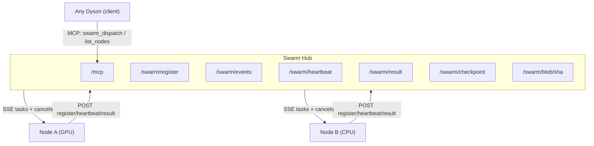
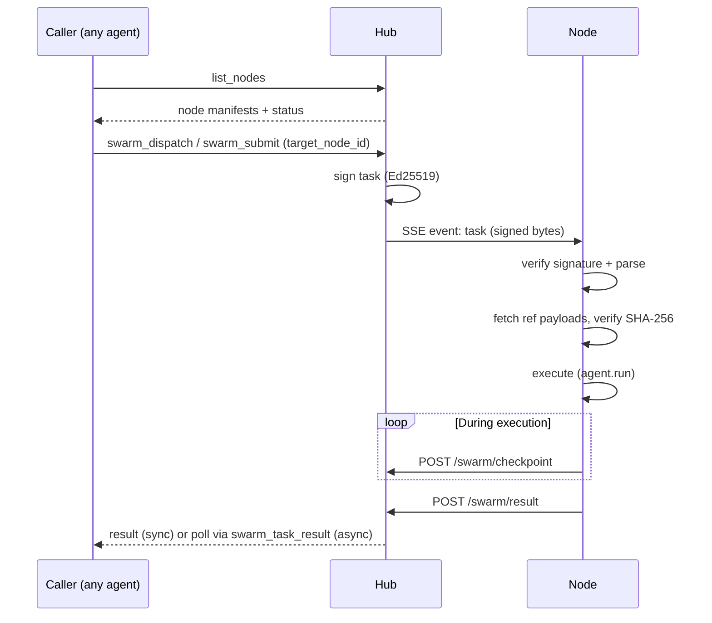
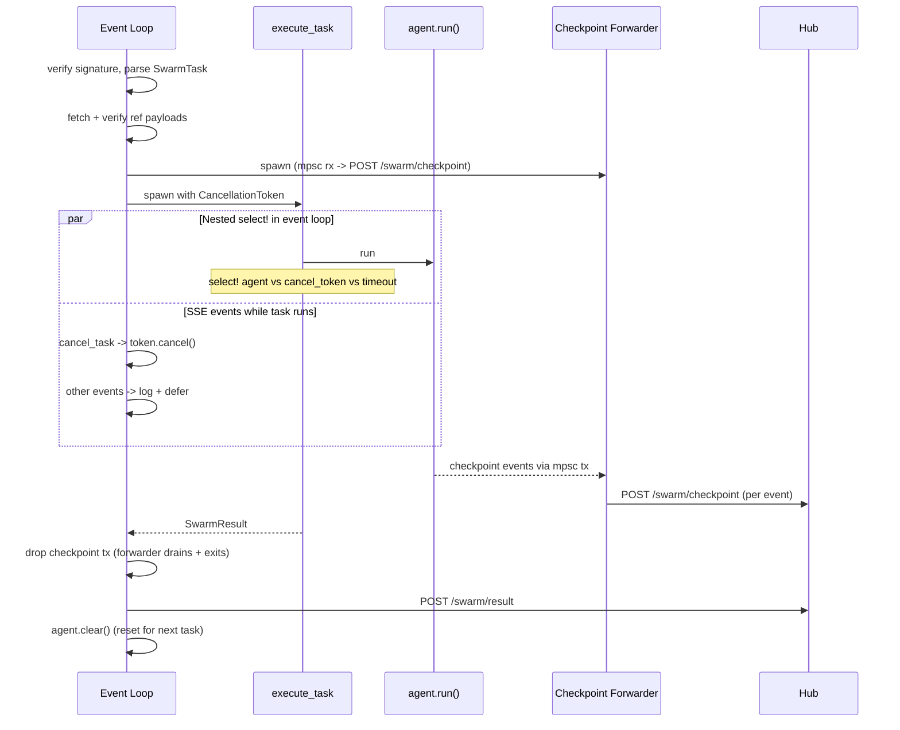
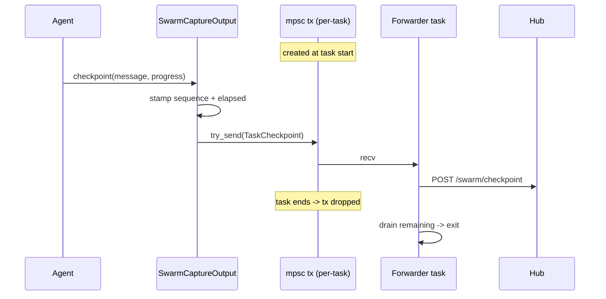
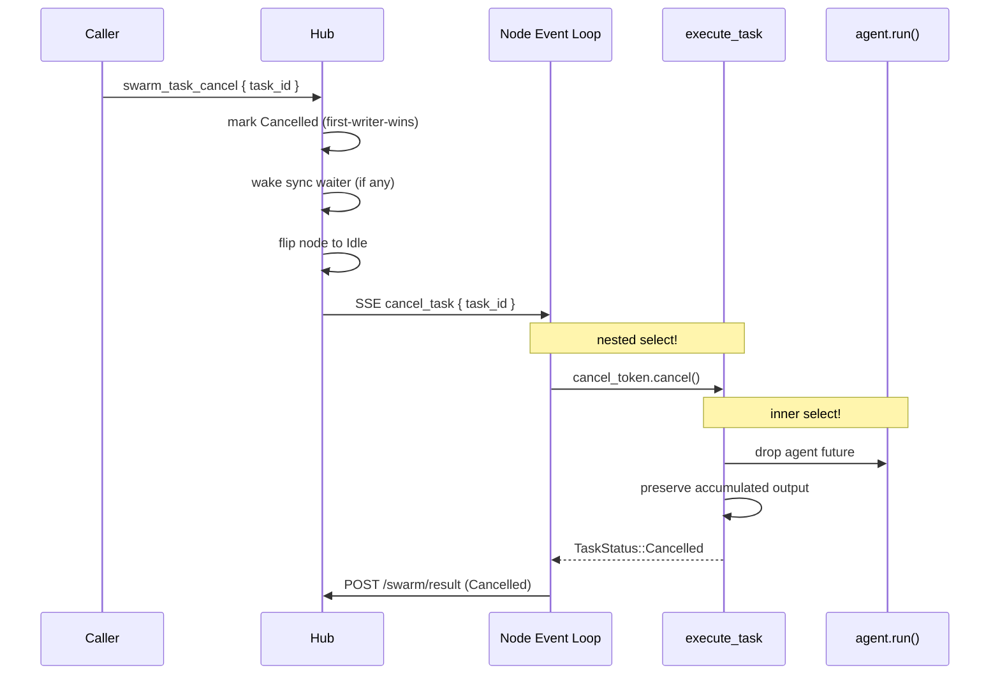

# Swarm

The swarm controller enables dynamic resource routing across Dyson nodes.
Adding a swarm controller makes this Dyson both a **worker** (the hub can
send it tasks) and a **client** (its agent can dispatch tasks to other nodes).
Participation is symmetric: you use the swarm because you are part of it.

**Key files:**
- `src/swarm/types.rs` — `NodeManifest`, `SwarmTask`, `SwarmResult`, `Payload`
- `src/swarm/verify.rs` — `SwarmPublicKey`, `verify_signed_payload()` (V1 Ed25519)
- `src/swarm/probe.rs` — `HardwareProbe` (GPU/CPU/RAM/disk detection)
- `src/swarm/connection.rs` — `SwarmConnection` (SSE inbound, POST outbound)
- `src/controller/swarm.rs` — `SwarmController`
- `src/config/mod.rs` — `SwarmControllerConfig`
- `src/command/listen.rs` — Controller factory + MCP auto-wiring

---

## Configuration

```json
{
  "controllers": [
    { "type": "terminal" },
    {
      "type": "swarm",
      "url": "https://hub.example.com",
      "public_key": "v1:K2dYr0base64encodedkey...",
      "node_name": "gpu-workstation-01"
    }
  ]
}
```

| Field | Required | Default | Description |
|-------|----------|---------|-------------|
| `url` | yes | — | Base URL of the swarm hub |
| `public_key` | yes | — | Versioned Ed25519 public key for task verification (`v1:base64...`) |
| `node_name` | no | `dyson-node-{hash}` | Human-readable name for this node (defaults to a deterministic hash of the hub URL) |

---

## Architecture



- **SSE** (hub -> node): signed tasks and cancel events pushed to connected nodes.
- **POST** (node -> hub): registration, heartbeats, results, checkpoints.
- **MCP** (any agent -> hub): auto-wired so agents get `swarm_dispatch` and other hub-defined tools.

---

## Task lifecycle

End-to-end flow from dispatch through result delivery:



**Sync vs async dispatch:**

| Path | Blocks? | Returns | Use when |
|------|---------|---------|----------|
| `swarm_dispatch` | Yes (up to timeout, default 600 s) | `SwarmResult` directly | Quick commands |
| `swarm_submit` | No | `{ task_id, node_id, state: "running" }` | Fine-tuning, batch jobs, pipelines |

Both insert into the same `TaskStore`, so `swarm_task_list`, `swarm_task_status`, `swarm_task_checkpoints`, `swarm_task_result`, and `swarm_task_cancel` work uniformly across them.

---

## Routing: the caller decides

The hub signs, tracks, and carries blobs. It deliberately does **not** decide which node runs a task — the caller (the LLM using MCP tools) does, because any JSON filter the hub could invent is strictly weaker than the caller's own reasoning about node affinity, loaded tools, OS preferences, and pipeline continuity.

The flow:

1. Call `list_nodes` — returns every peer's CPUs, GPUs (model + VRAM + driver), RAM, disk, OS, capabilities, status, `busy_task_id` if busy, and last heartbeat.
2. Reason about the best fit and call `swarm_dispatch` / `swarm_submit` with `target_node_id`.
3. Hub validates (exists, idle) and dispatches. On error, re-list and retry.

For callers that don't care ("any idle GPU node with 64 GB"), the legacy `constraints` path stays as a shortcut. Exactly one of `target_node_id` or `constraints` must be provided — a bare `{prompt}` is rejected with `NoTargetOrConstraints`.

Constraint filter rules (shortcut path): idle nodes only; optional `needs_gpu` / `needs_capability` / `min_ram_gb`; prefer most free RAM, ties broken by lowest `node_id`.

Dispatch errors surfaced to the caller:

| Error | When |
|-------|------|
| `NodeNotFound` | `target_node_id` unknown to the hub |
| `NodeNotIdle` | target exists but is busy or draining |
| `NoTargetOrConstraints` | dispatch call had neither field set |
| `NoEligibleNode` | constraint filter matched nothing |
| `Timeout` | sync `swarm_dispatch` exceeded its timeout |
| `Cancelled` | task was cancelled or SSE push failed |

---

## The Hub (Server)

The hub lives at [`crates/swarm/`](../crates/swarm/) and ships as a binary named `swarm`. It is an in-memory, tokio-based HTTP server responsible for:

1. **Node registry** — `POST /swarm/register` with a `NodeManifest`; returns `{ node_id, token }`.
2. **Node selection** — validates caller's `target_node_id` or falls back to constraint filter.
3. **Task dispatch + lifecycle** — signs the `SwarmTask` (Ed25519), pushes via SSE, records a `TaskRecord` in `TaskStore`.
4. **Progress checkpoints** — `POST /swarm/checkpoint` appended to task record; callers tail via `swarm_task_checkpoints { since_sequence }`.
5. **Cancellation** — marks record `Cancelled`, wakes sync waiters, pushes `cancel_task` SSE event. First-writer-wins on terminal states.
6. **Blob storage** — `GET/PUT /swarm/blob/{sha256}` for large payloads.
7. **Health monitoring** — heartbeats, stale-node reaping, terminal-task reaping (24 h, same 15 s ticker).

State is ephemeral: a hub restart forgets every registered node and every in-flight task.

### Running the hub

```bash
# Generate a signing key (one-time)
swarm-keygen --out ./hub-data/hub.key

# Localhost (no TLS needed)
swarm --bind 127.0.0.1:8080 --data-dir ./hub-data

# External interface with manual TLS
swarm --bind 0.0.0.0:443 --data-dir ./hub-data \
      --cert cert.pem --private-key key.pem

# Or with Let's Encrypt
swarm --bind 0.0.0.0:443 --data-dir ./hub-data \
      --letsencrypt --domain hub.example.com
```

The hub prints the public key on startup: `Hub public key (add to node config): v1:K2dYr0base64encodedkey...`

### CLI flags

| Flag | Default | Description |
|------|---------|-------------|
| `--bind` | `127.0.0.1:8080` | HTTP(S) listen address |
| `--data-dir` | `./hub-data` | Where `hub.key` and `blobs/` live |
| `--heartbeat-timeout-secs` | `90` | Reap nodes whose last heartbeat is older than this |
| `--log-level` | `info` | `tracing` env filter |
| `--cert` | — | TLS certificate chain (PEM). Requires `--private-key` |
| `--private-key` | — | TLS private key (PEM). Requires `--cert` |
| `--letsencrypt` | — | Enable Let's Encrypt automatic TLS. Requires `--domain` |
| `--domain` | — | Domain name for Let's Encrypt |
| `--letsencrypt-email` | — | Contact email for Let's Encrypt registration |
| `--cert-cache-dir` | `.swarm-certs` | Directory to cache Let's Encrypt certificates |
| `--mcp-api-key-hash` | — | Argon2id PHC hash for static MCP API key authentication |
| `--dangerous-no-tls` | — | Allow plain HTTP on non-localhost interfaces |
| `--dangerous-no-auth` | — | Allow running without authentication on non-localhost interfaces |

### Hub endpoints

| Endpoint | Method | Purpose |
|----------|--------|---------|
| `/mcp` | POST | MCP JSON-RPC (tool discovery + task dispatch + task queries) |
| `/swarm/register` | POST | Node registration, returns `{ node_id, token }` |
| `/swarm/events` | GET | SSE stream for pushing tasks/cancels to a node |
| `/swarm/heartbeat` | POST | Node status update |
| `/swarm/result` | POST | Task result from a node |
| `/swarm/checkpoint` | POST | Progress event from an in-flight task |
| `/swarm/blob/{sha256}` | GET | Download a payload blob by hash |
| `/swarm/blob/{sha256}` | PUT | Upload a result payload blob |

`/mcp` accepts an optional `?caller=<node_name>` to exclude the calling node from `list_nodes`. `/swarm/checkpoint` and `/swarm/result` are authed by the node's bearer token from registration.

### SSE event types

Events flow hub -> node over `/swarm/events`.

| Event | Data | Description |
|-------|------|-------------|
| `registered` | `{ "node_id": "..." }` | Registration confirmed |
| `task` | base64 of signed wire bytes | Execute this task |
| `heartbeat_ack` | `{}` | Heartbeat received |
| `cancel_task` | `{ "task_id": "..." }` | Cancel the named in-flight task |
| `shutdown` | `{}` | Graceful disconnect requested |

### Signing tasks

The hub signs every task with its Ed25519 private key. Wire format:

```
version (1 byte) || signature (64 bytes) || canonical JSON payload
```

V1 = Ed25519. No algorithmic agility. To change the algorithm, bump the version. Nodes reject any version they don't recognize.

---

## The Node (Client)

When `"type": "swarm"` appears in the controllers config, Dyson does two things automatically.

### 1. Creates a SwarmController (worker)

Lifecycle phases:

- **Build agent** — shared `ClientRegistry`; excludes `swarm_dispatch` (prevents recursion); injects controller prompt; wraps `list_nodes` via `?caller=` so the agent only sees peers.
- **Probe hardware** — `HardwareProbe::run()` detects OS, GPUs (`nvidia-smi` / `system_profiler`), CPUs (`/proc/cpuinfo` / `sysctl`), RAM, disk. Capabilities = agent's loaded tool names.
- **Register** — `POST /swarm/register` -> `{ node_id, token }`.
- **Connect** — `GET /swarm/events` opens the SSE stream; spawns a heartbeat task (POST every 15 s, tears down on 3 consecutive failures).
- **Event loop** — receives tasks, executes, reconnects on disconnect (exponential backoff: base 2 s, cap 60 s, max 10 attempts).

Per-task execution with the nested `select!` races:



### 2. Auto-wires the hub as an MCP skill (client)

The hub URL is injected into `settings.skills` as an MCP server:

```rust
// listen.rs — when "swarm" controller is created:
let node_name = swarm_config.node_name_or_default();
let hub_base = swarm_config.url.trim_end_matches('/');

settings.skills.push(SkillConfig::Mcp(Box::new(McpConfig {
    name: format!("swarm_{node_name}"),
    transport: McpTransportConfig::Http {
        url: format!("{hub_base}/mcp?caller={node_name}"),
        ..
    },
    exclude_tools: vec![],
})));
```

This means **every** agent on this Dyson (terminal, telegram, swarm) gets the hub's MCP tools — `swarm_dispatch`, `swarm_submit`, `swarm_status`, `list_nodes`, and the task-query tools.

The swarm controller's own agent is special:
- `swarm_dispatch` is excluded (prevents recursive task loops)
- `list_nodes` results are filtered by the hub (via `?caller=`) so the agent never sees its own node
- A controller prompt instructs the agent to use tools (especially bash) and never guess at system details

---

## Checkpoints

A built-in tool the swarm controller's agent can call during execution:

```
swarm_checkpoint { message, progress? }
```

Each call attaches a `CheckpointEvent` to the tool's `ToolOutput` as a side-channel. The agent execution loop forwards these to the controller's `Output::checkpoint` hook.



The channel is scoped per task — stray events can never land on the wrong record. Outside the swarm controller, the default `Output::checkpoint` impl drops the event, so the tool is a harmless no-op for terminal and telegram agents.

The agent is encouraged (via the controller prompt) to emit checkpoints at natural milestones — per epoch, per batch, per pipeline stage.

### Polling MCP tools

| Tool | Purpose |
|------|---------|
| `swarm_task_status { task_id }` | Lightweight state: `state`, `checkpoint_count`, `last_sequence`, timestamps |
| `swarm_task_checkpoints { task_id, since_sequence? }` | Ordered checkpoint list with sequence strictly greater than `since_sequence` (default 0) — tail progress incrementally |
| `swarm_task_result { task_id }` | `{ state, result? }`.  `result` is absent while running, present once terminal |
| `swarm_task_cancel { task_id }` | Mark a running task cancelled and push a `cancel_task` SSE event to the owning node |
| `swarm_task_list { limit? }` | Recent tasks newest-first, bounded by `limit` (default 50). Includes sync dispatches too — every task flows through the same store |

`swarm_task_result` shape: while running, only `state` appears; once terminal (`completed` / `failed` / `cancelled`) the full `SwarmResult` is attached.

### Storage and lifetime

`TaskRecord`s are in-memory only — no persistence across hub restart. The reaper drops terminal tasks older than 24 hours. Retrieve results before restarting the hub.

---

## Cancellation

`swarm_task_cancel { task_id }` is a three-step cooperative cancel:



Cancellation is **cooperative, not instant**: a running bash command finishes its current output read before the tool result is discarded. Training loops that yield regularly stop almost immediately; a tight CPU-bound bash loop doesn't. Treat cancellation as "please stop soon" rather than a hard kill.

`TaskStore::finalize` is first-writer-wins: if the node races the hub and posts a result after cancellation, the state stays `Cancelled` but the node's actual `SwarmResult` is stored under `result` for debugging.

---

## Payloads

Tasks and results can carry file attachments. Two tiers:

**Inline** — Small data (configs, prompts) travels inside the signed envelope:

```json
{ "type": "inline", "name": "config.yaml", "data": "base64..." }
```

**Ref** — Large data (datasets, model weights) is referenced by SHA-256 hash and transferred separately:

```json
{ "type": "ref", "name": "dataset.json", "sha256": "a1b2c3...", "size": 2147483648 }
```

The signature covers the hashes, so tampering with referenced data breaks the verification chain. The node fetches blobs via `GET /swarm/blob/{sha256}` and verifies the hash before starting work.

---

## Signature Verification

No algorithmic agility. Each version specifies exactly one algorithm.

| Version | Algorithm | Key size | Signature size |
|---------|-----------|----------|----------------|
| V1 (`0x01`) | Ed25519 (RFC 8032) | 32 bytes | 64 bytes |

The public key in config encodes the version:

```
"public_key": "v1:K2dYr0base64encodedkey..."
              ---  -------------------------
              version    32 bytes, base64
```

Verification steps:
1. Read version byte from wire message.
2. Version doesn't match config key? **Reject.** No fallback.
3. Verify Ed25519 signature over the JSON payload bytes.
4. Invalid? **Reject.** Parse the now-trusted JSON as `SwarmTask`.

---

## Node Manifest and `list_nodes`

Sent during registration; the hub stores it and surfaces it via `list_nodes`. Each row returns the manifest plus runtime state:

```json
{
  "node_id": "uuid",
  "node_name": "gpu-workstation-01",
  "os": "linux",
  "status": "busy",
  "busy_task_id": "uuid",
  "capabilities": ["bash", "read_file", "web_search", "mcp__github__create_pull_request"],
  "hardware": {
    "cpus": [{ "model": "AMD Ryzen 9 7950X", "cores": 32, "physical_cores": 16 }],
    "gpus": [{ "model": "NVIDIA RTX 4090", "vram_bytes": 25769803776, "driver": "560.35", "cores": null }],
    "ram_bytes": 68719476736,
    "disk_free_bytes": 500000000000
  },
  "last_heartbeat_unix": 1744387200
}
```

Hardware detection is conditional-compiled per OS. `busy_task_id` only appears when `status` is `"busy"`. `last_heartbeat_unix` is the wall-clock time of the most recent heartbeat.

---

## Network Security

The hub enforces two safety checks on non-localhost interfaces. Localhost (`127.0.0.1`, `::1`) skips both automatically.

### TLS

TLS is **mandatory** when binding to a non-localhost address. Two modes:

- **Manual**: `--cert` and `--private-key` PEM files.
- **Let's Encrypt**: `--letsencrypt` and `--domain`. Certificates provisioned via TLS-ALPN-01 (same port, no port 80 needed), cached in `--cert-cache-dir` (default `.swarm-certs`).

Pass `--dangerous-no-tls` to serve plain HTTP on external interfaces (not recommended).

### Authentication

**Node tokens** — On `POST /swarm/register` the hub generates a random 32-byte bearer token; all subsequent node requests must include `Authorization: Bearer <token>`.

- **Protected:** `/swarm/events`, `/swarm/heartbeat`, `/swarm/result`, `/swarm/blob`, `/mcp` `tools/call`
- **Unprotected:** `/swarm/register` (to obtain a token), `/mcp` `initialize` / `tools/list` (MCP handshake)

**Static API key** — For external MCP clients (e.g., Dyson agents on non-swarm nodes), the hub supports a static API key verified against an argon2id hash. The plaintext key never touches disk.

```bash
# Generate a hash (argon2 CLI)
echo -n "my-secret-key" | argon2 $(openssl rand -hex 16) -id -e

# Or with Python
python3 -c "from argon2 import PasswordHasher; print(PasswordHasher().hash('my-secret-key'))"

# Start the hub with the hash
swarm --bind 0.0.0.0:443 --data-dir ./hub-data \
      --cert cert.pem --private-key key.pem \
      --mcp-api-key-hash '$argon2id$v=19$m=19456,t=2,p=1$SALT$HASH'
```

MCP clients authenticate with `Authorization: Bearer <plaintext-key>`. The hub tries the fast node-token lookup first (O(1)), then falls back to argon2id verification (~30-50ms) if the token doesn't match any registered node.

API key callers get a synthetic owner ID (`apikey:<hash-prefix>`) so task ownership scoping works — their tasks are invisible to node-token callers and vice versa.

### Deployment patterns

| Pattern | Command | Notes |
|---------|---------|-------|
| **Localhost** | `swarm --bind 127.0.0.1:8080 --data-dir ./hub-data` | No TLS, no flags. Good for development. |
| **SSH forward** | Hub: `--bind 127.0.0.1:8080`; nodes: `ssh -L 8080:127.0.0.1:8080 user@hub -N` | Nodes point at `http://127.0.0.1:8080`; traffic encrypted via SSH. |
| **Tailscale / WireGuard** | `swarm --bind 100.x.y.z:443 --data-dir ./hub-data --cert cert.pem --private-key key.pem` | All traffic within the mesh. |
| **Public internet** | `swarm --bind 0.0.0.0:443 --data-dir ./hub-data --letsencrypt --domain hub.example.com` | TLS mandatory. Restrict access at the firewall to known node IPs. |

---

## Example flow — fine-tune a model

```
1. Caller:  swarm_submit { prompt: "fine-tune meta-llama/Llama-3.1-8B on data.jsonl ...",
                           constraints: { needs_gpu: true, min_ram_gb: 64 } }
            -> { task_id: "abc-123", node_id: "gpu-02", state: "running" }

2. Node agent during execution:
   - loads dataset
   - swarm_checkpoint { message: "dataset loaded", progress: 0.05 }
   - starts training
   - per epoch: swarm_checkpoint { message: "epoch N/10 loss=...", progress: N/10 }
   - saves weights to ./model.safetensors (picked up via send_file)

3. Caller polls:
   - swarm_task_checkpoints { task_id: "abc-123", since_sequence: 0 }
     -> progress lines so far
   - swarm_task_result { task_id: "abc-123" }
     -> { state: "completed", result: { text: "...", payloads: [...] } }
```

---

## Testing

```bash
# All swarm tests (28 tests)
cargo test --lib -p dyson swarm

# Controller tests (9 tests)
cargo test --lib -p dyson controller::swarm
```

Tests cover:
- Ed25519 sign/verify roundtrip, tampered payload, tampered signature, wrong key, wrong version
- Public key parsing: valid, invalid version, bad base64, wrong length
- SSE event parsing: registered, task, heartbeat_ack, shutdown, unknown, incomplete, multiline
- nvidia-smi output parsing: single GPU, multiple GPUs, empty, malformed
- `/proc/cpuinfo` parsing: single model, mixed models, empty (Linux only)
- `/proc/meminfo` parsing: normal, missing, empty (Linux only)
- macOS VRAM string parsing, system_profiler JSON parsing (macOS only)
- SwarmControllerConfig: valid, defaults, missing required fields
- Inline payload fetch and verification

---

## What v1 doesn't do

- **Persistence**: hub restart loses all in-flight and recent task state.
- **Queueing**: if no node is eligible, both dispatch paths fail fast with `no eligible node`.
- **Automatic progress**: checkpoints are explicitly emitted by the agent calling `swarm_checkpoint`. No automatic scraping of bash stdout.
- **Hard kill of bash subprocesses on cancel**: tools that don't check `ctx.cancellation` keep running until their next async yield point.
