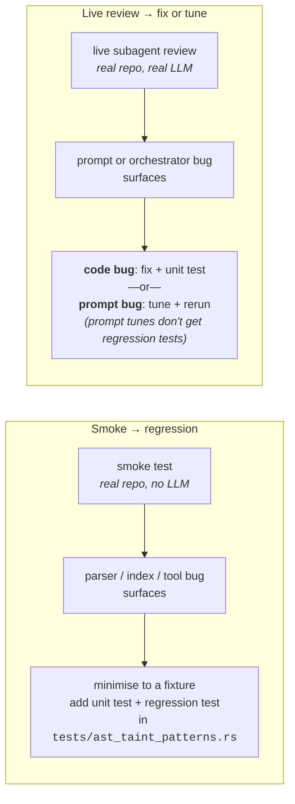

# Testing and Tuning

Dyson has four layers of test infrastructure, each answering a different question.  Most of them are cheap and run in CI; one is expensive and run by hand when tuning a subagent against a specific model.

| Layer | Asks | Cost | Where |
|---|---|---|---|
| Unit tests | "Does this function do what I wrote?" | Free | `cargo test` |
| Smoke tests | "Do tools work on real production-scale code?" | Free (disk + clone time) | `cargo run --example smoke_*` |
| Integration / regression tests | "Does the bug we found last month stay fixed?" | Free | `cargo test` (root `tests/`) |
| Live subagent review | "Does the prompt actually produce useful output under my production model?" | Billable LLM calls | `cargo run --example expensive_live_security_review` |

The layers are connected by two loops:



## Unit tests — `cargo test`

1100+ tests covering the full stack: SSE parsing, sandbox decisions, config loading, workspace persistence, the agent loop with mock LLM clients, every tool's input-validation and happy-path behavior.  These are the base.  Every new feature and every bug fix adds one.

## Smoke tests — `cargo run -p dyson --example smoke_*`

Three examples in `crates/dyson/examples/` shallow-clone ~30 real open-source repos (tokio, bevy, deno, TypeScript, react, rails, pandoc, kotlinx, swift-nio, zig, elixir, erlang, ocaml, ...) into `$TMPDIR/dyson-smoke-repos/` and exercise one tool against the full corpus:

- `smoke_ast_query` — runs representative S-expression queries per language and asserts every one compiles and produces matches
- `smoke_ast_describe` — parses a small snippet in every supported language and asserts the tree contains expected node kinds (guards against grammar-name drift when a grammar is upgraded)
- `smoke_taint_trace` — builds the symbol index and runs source→sink traces per repo, reporting `UnresolvedCallee` rates and `TRUNCATED` flags

These do **not** use an LLM.  They are deterministic exercises of parser and indexer behavior on production-scale code.  First run takes ~5 minutes (mostly clones, ~2 GB disk); subsequent runs ~30 seconds.  Run them before any change to AST plumbing or a grammar upgrade.

**Failure handling — promote smoke bugs into regression tests.**  When a smoke test surfaces a real bug (a grammar name drifted, an index miscounts, a trace returns the wrong path), the fix is **not** to patch it silently.  The workflow is:

1. Minimise the failing repo down to the smallest file that reproduces the bug.
2. Add it as a unit test next to the offending module (e.g. `src/ast/taint/index.rs` tests).
3. Add an integration test in `tests/ast_taint_patterns.rs` that codifies the fix — the file header explicitly reads *"Each test is a regression guard for a real-world failure mode the isolated unit tests missed."*
4. Only then patch the bug.

This is how smoke findings graduate into the regression suite.  Without step 3, the next grammar upgrade rediscovers the same bug.

## Integration / regression tests — `tests/*.rs`

- `tests/ast_taint_patterns.rs` — codified taint-trace patterns from smoke-test discoveries
- `tests/security_regression.rs` — fix-remains-in-place guards for security-sensitive changes
- `tests/agent_eval.rs`, `tests/subagent_eval.rs` — structured evaluations of agent behavior
- `tests/property_tests.rs` — proptest-driven fuzzing, with regression corpus in `*.proptest-regressions`

These run under `cargo test` and gate merges.

## Live subagent review — `expensive_live_security_review`

The gap the other three layers don't close: **"does the prompt itself produce good output when driven by the model I actually use in production?"**  A subagent prompt is code; its executable form is the LLM that runs it; and LLMs differ.  A `security_engineer.md` tuned against Claude might fail quietly on a cheaper Qwen / Minimax / Gemini because weaker models gravitate toward familiar tools (grep) over novel ones (tree-sitter queries), or narrate before their output, or hallucinate tool output to look rigorous.

`crates/dyson/examples/expensive_live_security_review.rs` spins up the **real** orchestrator — `security_engineer` with its direct tools plus the inner planner/researcher/coder/verifier subagents — and runs it against a fixed set of deliberately-vulnerable repos (OWASP Juice Shop, NodeGoat, RailsGoat).  The example uses whatever provider and model `dyson.json` resolves to; `--model` overrides it for a single run.  Output lands in `/tmp/dyson-security-review-<target>[-<suffix>].md`.

This is explicitly not a `cargo test`.  A single target is ~10 minutes of LLM calls.  A full sweep is billable.  It's opt-in.

```bash
# Single target, default model from dyson.json
cargo run -p dyson --example expensive_live_security_review --release -- \
    --config dyson.json --target juice-shop

# Multiple runs against the same target, each output to its own file
cargo run -p dyson --example expensive_live_security_review --release -- \
    --config dyson.json --target juice-shop --report-suffix iter1

# Full sweep
cargo run -p dyson --example expensive_live_security_review --release -- \
    --config dyson.json --expensive-scan-all-targets
```

### Iteration methodology — run, grade, tune, run

The live example is designed to support a tight **run → grade → tune → run** loop:

1. **Run** the subagent against a fixed target with the current prompt, using `--report-suffix iterN` so outputs don't clobber each other.
2. **Grade** against the heuristics in [Subagents → Evaluating report quality](subagents.md#evaluating-report-quality) plus a tool-call histogram from the run's log:
    ```bash
    grep 'tool call started' /tmp/dyson-live-run-iterN.log \
      | grep -oE '"[a-z_]+"' | sort | uniq -c | sort -rn
    ```
    Signals we track:
    - **Tool usage mix.**  Did `ast_query` / `taint_trace` actually run, or did the model fall back to `grep`-flavored tools?
    - **Fabricated output.**  Do the `Taint Trace:` blocks in the report match real tool output in the log, or were they invented?
    - **Report structure.**  All severity sections present?  Checked and Cleared comprehensive?  `Impact:` on every finding?
    - **Response leakage.**  Preamble before the first heading?  Trailing summary?
    - **Finding accuracy.**  Known-vulnerable repos let you check findings against a ground-truth list (Juice Shop's challenge catalog, etc.).
3. **Tune** the prompt based on what failed.  Small targeted changes; never rewrite everything.
4. **Rerun** with a new `--report-suffix` and diff behavior.

Prompt tunes don't get regression tests — LLM outputs are non-deterministic by nature, and a regression test would either be flaky or would only assert that *a* tool was called, which is too weak.  The iteration transcript (logs + reports under distinct suffixes) is the "test artifact"; the prompt change itself is the fix.

Code changes discovered in the loop — e.g. the `OrchestratorTool.path` input that decouples the child agent's working directory from the process CWD — DO get unit tests.  Those live in `src/skill/subagent/tests.rs`.

### Case study: tuning `security_engineer.md` for a smaller model

This methodology was used to adapt `security_engineer.md` from Claude to OpenRouter's Qwen3.6-plus — a much cheaper model with different failure modes.  Baseline behavior: zero `ast_query` calls, zero `taint_trace` calls, fabricated `Taint Trace:` blocks formatted to look authoritative, grep used for sink enumeration.  Target behavior: real tool usage, verbatim pasted output, complete report structure.

Four iterations against OWASP Juice Shop's `routes/` subpath:

| Iter | Tune | Effect |
|---|---|---|
| 1 | Add `path` input to `OrchestratorTool` (fixes bash-cwd drift) + full prompt rewrite (worked example of `ast_describe` → `ast_query` → `taint_trace` composition, anti-fabrication rule, tool-call ledger) | `ast_query` 0 → 6; `taint_trace` 0 → 4; no more fabricated blocks |
| 2 | Kill preamble leak ("Response shape" rule); require `Impact:` on every finding | Impact discipline landed; preamble persisted; `ast_query` regressed to 0 |
| 3 | Concrete forbidden preamble phrases (not abstract rule); whole-report MEDIUM cap if `ast_query == 0`; push cross-function taint sources | Preamble killed; `ast_query` recovered to 4 — BUT harsh cap caused premature termination, report collapsed from 27k → 5.6k bytes |
| 4 | Per-finding (not whole-report) `ast_query` penalty; clarify "paste real output required, inventing forbidden" distinction; explicit completeness rule requiring all seven report sections | Full structure restored; preamble stayed dead; verbatim taint output restored; real findings across CRITICAL/HIGH/MEDIUM |

**Lessons that generalise to other subagents:**

- **Concrete negative examples beat abstract rules.**  "Do not start with 'Now I have comprehensive understanding…'" worked where "no preamble" did not.  Weaker models pattern-match on phrases more reliably than on abstractions.
- **Per-finding penalties beat report-wide ones.**  A hard "entire report capped at X if Y" triggers premature termination — the model shortens instead of recovering.  Demoting *specific* findings that fail a check leaves the rest of the output intact.
- **Clarify the boundary between "must" and "must not".**  "Paste real tool output" and "don't fabricate tool output" look similar enough that a weaker model collapses both into "don't mention tool output", which silently deletes required evidence.  Separate the two rules explicitly.
- **Some ceilings are model limits, not prompt problems.**  Even after four iterations, Qwen preferred `search_files`/`grep` over `ast_query` for some sink enumeration — a preference for familiar tools that prompt pressure only partially moves.  Know when to stop tuning.

The live review is how you find out any of this in the first place.  Running `cargo test` would not have told you the prompt was fabricating taint traces, because unit tests never call an LLM.

## Adding a new orchestrator or subagent

1. Write the prompt at `src/skill/subagent/prompts/<role>.md` and register via `OrchestratorConfig` or `SubagentAgentConfig`.
2. Add unit tests in `src/skill/subagent/tests.rs` for the tool's input validation, tool filtering, depth limit, and `path` propagation.
3. If the role uses AST tools, run the three `smoke_*` examples against the grammars it depends on and ensure they stay green.
4. Create a live-review example following the `expensive_live_security_review.rs` template — pick a fixed set of target repos where you know what findings are possible.
5. Iterate against your production model using the run → grade → tune → run loop until the output matches what you'd accept from a human doing the same role.

Step 5 is the one people skip.  Don't.
