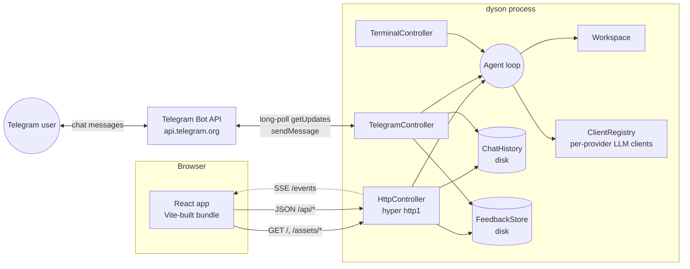
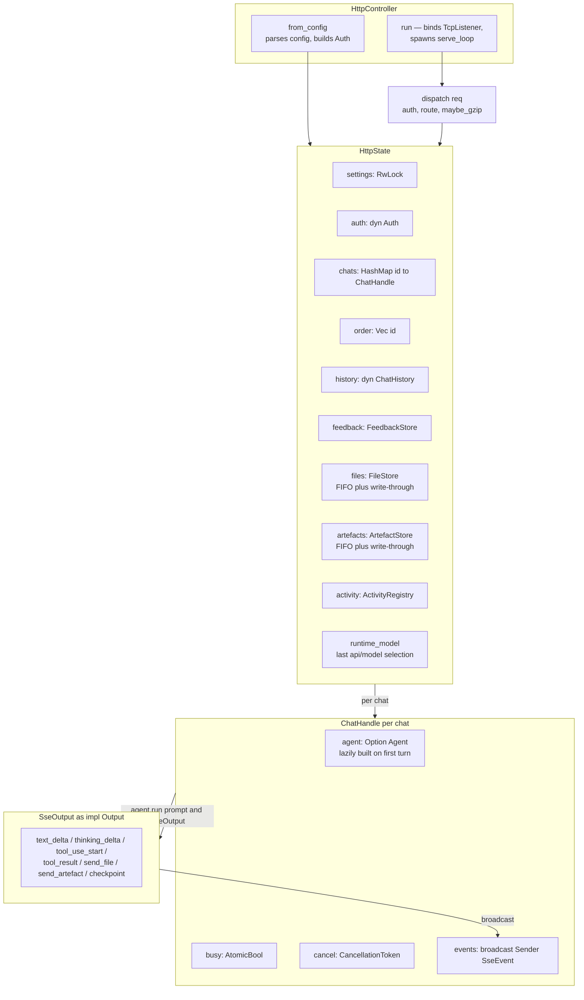
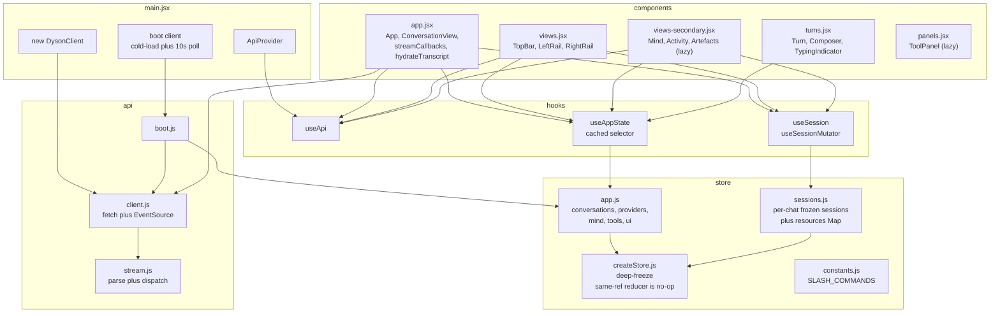
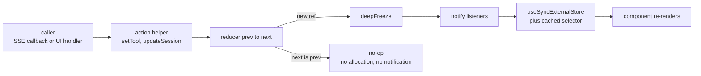
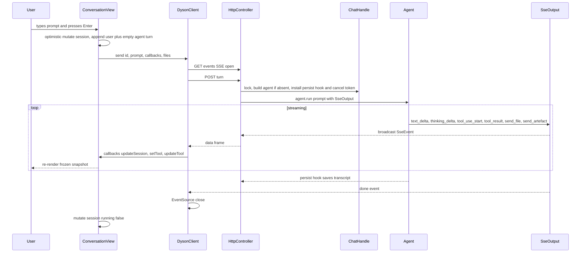

# Web UI / HTTP Controller

> ## Loopback only.  Do not expose this to the public internet.
>
> The HTTP controller has two inbound-auth modes: `bearer` (shared
> token on every `/api/*` request) and `dangerous_no_auth` (anonymous,
> every request accepted).  Either way it's designed for a single
> trusted operator behind loopback or a VPN mesh.  Bind to `127.0.0.1`
> (the default) and reach it remotely via SSH tunnel or Tailscale —
> never via `0.0.0.0` on a host with public network exposure.  See
> [README — Web UI](../README.md#web-ui).

The HTTP controller serves a small React UI plus a JSON API + Server-Sent
Events stream.  It implements the same `Controller` trait as the
terminal and Telegram controllers and shares `ChatHistory` +
`FeedbackStore` + `ClientRegistry` with them, so a chat started on
Telegram shows up in the web sidebar (and vice versa) and an artefact
written from a Telegram subagent surfaces in the web Artefacts tab
through `BrowserArtefactSink`.

---

## Overall architecture



The controller is one process; chats are minted in-memory and persisted
through the `ChatHistory` trait.  All three controllers point at the
same on-disk chat directory, so `list_conversations` merges Telegram
chats into the web sidebar by reading mtime-sorted ids off disk and
hydrating in-memory `ChatHandle`s on demand.

`build.rs` runs `npm run build` on every cargo build (mtime-gated —
nothing fires when the frontend is untouched), walks the resulting
`dist/`, and `include_bytes!`s every file into the binary.  A deployed
binary needs nothing but itself.

---

## Configuration

Add to your `dyson.json` `controllers` array:

```json
{ "type": "http", "bind": "127.0.0.1:7878" }
```

| field | type | default | description |
|---|---|---|---|
| `bind` | `string` | `"127.0.0.1:7878"` | Loopback-only is the only supported deployment.  Listening on `0.0.0.0` exposes the agent. |
| `auth` | `object` | `dangerous_no_auth` on loopback, **required** otherwise | Inbound authentication.  See below. |

There is no on-disk `webroot` override.  The frontend is always served
from the bundle `build.rs` embeds at compile time (mtime-gated, so
clean trees are no-ops); to iterate on the UI, run the Vite dev server
on `:5173` against a live dyson on `:7878` — see
[Developing the frontend](#developing-the-frontend).  Splitting the
"how is this binary running?" question into "release binary serves
itself" vs "dev server proxies to it" eliminated a configuration knob
that was useful for one workflow and confusing for everyone else.

### Authentication

On a loopback bind (`127.0.0.1` / `::1`) the `auth` field is optional:
the loopback threat model is a single trusted operator, so an unset
field defaults to `dangerous_no_auth`.  On any other bind it is
**required** — omitting it makes the controller refuse to start
rather than silently expose an unauthenticated endpoint.  Mirrors the
posture `--dangerous-no-sandbox` takes for the sandbox boundary.

```json
{ "auth": { "type": "dangerous_no_auth" } }
```

```json
{
  "auth": {
    "type": "bearer",
    "hash": { "resolver": "insecure_env", "name": "DYSON_WEB_BEARER_HASH" }
  }
}
```

`bearer` requires `Authorization: Bearer <plaintext>` on every
`/api/*` request; the controller verifies the plaintext against a
stored Argon2id PHC hash.  Mismatches return `401
{"error":"unauthorized"}`.  Static shell paths (`/`, `/assets/*`) are
exempt so the UI can load before the browser presents the credential.
The `hash` field flows through the same secret-resolver pipeline that
Telegram's `bot_token` uses, so it can be a literal `$argon2id$...`
string or an env-var reference.

#### Generating the hash

```bash
$ dyson hash-bearer 'super-secret-token'
$argon2id$v=19$m=19456,t=2,p=1$NkM4...$bjA0...
```

Paste the output into `auth.hash`.  Keep the plaintext for the
browser; never put plaintext in `dyson.json`.

#### Why hash a static token?

A bearer token in plaintext is a one-step credential: any leak of the
config (cloud snapshot, an accidentally-committed dotfile, a terminal
recording with `cat dyson.json` in the scrollback, a backup tarball)
hands an attacker a working token immediately.  Argon2id breaks that
chain — a disclosed hash still requires brute-forcing a memory-hard
KDF before it grants entry, and the hash params (`m=19456,t=2,p=1`)
travel inside the PHC string itself, so a future hardening upgrade
just changes what `dyson hash-bearer` emits without migrating stored
hashes.  The plaintext only ever exists in the operator's head and
the browser's `Authorization` header.

Both variants implement the shared `Auth` trait at
[`crates/dyson/src/auth/mod.rs`](../crates/dyson/src/auth/mod.rs)
(also used by the MCP server).  `bearer` resolves to
[`HashedBearerAuth`](../crates/dyson/src/auth/hashed_bearer.rs) — a
verify-only impl that holds no plaintext.

---

## Backend (Rust)



[`HttpController`](../crates/dyson/src/controller/http/mod.rs) parses
config in `from_config`, builds the `Auth` impl, and in `run()`
constructs the shared `HttpState`, hydrates `FileStore` /
`ArtefactStore` / chat ids from disk, then loops on
`TcpListener::accept()` spawning a hyper http1 task per connection.

Every request goes through `dispatch_inner`:

1. If the path starts with `/api/`, validate auth — `401` on failure.
2. Match the route table.  Conversation, provider, mind, activity,
   model, file, and artefact endpoints route to small async handlers
   on `&HttpState`.
3. Static fall-through serves the embedded bundle.
4. `dispatch` wraps the inner response with `maybe_gzip` when the
   client accepts it and the content-type is in
   `compressible_content_type`.  SSE responses skip compression — their
   content-type isn't compressible and buffering would defeat
   streaming.

A `ChatHandle` is created on first list / load / turn for an id.  The
embedded `Agent` is built lazily on first turn through `build_agent`,
and on construction the controller replays any persisted transcript
from `ChatHistory::load` so context survives restarts.  The agent's
persist hook (set on every turn) checkpoints the transcript on every
message push, so a kill mid-run preserves whatever the agent had
committed.

`SseOutput` implements the `Output` trait the agent loop drives.  Each
method maps to one `SseEvent` variant and sends it through the chat's
`broadcast::Sender`.  `tool_use_start` also remembers the tool's id
on the output so any `send_file` / `send_artefact` calls that follow
within the same `tool_result` get stamped with that `tool_use_id` —
that's how image artefacts wire back to their `image_generate` panel
on chat reload.

`FileStore` and `ArtefactStore` are FIFO-evicted in-memory caches with
write-through to `{chat_history.connection_string}/files/` and
`{chat}/artefacts/` respectively.  Memory cap keeps long-running
sessions bounded; bytes stay reachable from disk on cache miss.

`BrowserArtefactSink` is the cross-controller hook: when a Telegram
turn calls `Output::send_file`, `HttpState::publish_file_as_artefact`
mirrors the file into the same store and (best-effort) broadcasts it
on the chat's SSE channel if a browser is currently subscribed.

---

## API surface

All endpoints return JSON unless noted.  Errors are
`{ "error": "<message>" }` with a non-2xx status.

### Conversations

| Method | Path | Body | Returns |
|---|---|---|---|
| `GET` | `/api/conversations` | — | `[ConversationDto]` newest-first by mtime |
| `POST` | `/api/conversations` | `{ title?, rotate_previous? }` | `{ id, title }` |
| `GET` | `/api/conversations/:id` | — | `{ id, title, messages: [MessageDto] }` |
| `DELETE` | `/api/conversations/:id` | — | `{ deleted, preserved }` (preserved=true means rotated, not hard-deleted) |
| `POST` | `/api/conversations/:id/turn` | `{ prompt, attachments? }` | `202 { ok: true }` — events stream via SSE |
| `POST` | `/api/conversations/:id/cancel` | — | `{ ok: true }` — drops the agent's CancellationToken |
| `GET` | `/api/conversations/:id/events` | — | `text/event-stream` of `SseEvent` |
| `GET` | `/api/conversations/:id/feedback` | — | `[FeedbackEntry]` |
| `POST` | `/api/conversations/:id/feedback` | `{ turn_index, emoji }` | `{ ok, rating? }` (empty `emoji` removes) |
| `GET` | `/api/conversations/:id/artefacts` | — | `[ArtefactSummary]` |
| `GET` | `/api/conversations/:id/export` | — | ShareGPT JSON blob |

`ConversationDto` carries `{ id, title, live, has_artefacts, source }`
where `source` is `"http"` / `"telegram"` / `"swarm"` so the sidebar
can badge cross-controller chats.

`MessageDto.blocks[*]` discriminator is `type`:

- `text` — `{ text }`
- `thinking` — `{ thinking }`
- `tool_use` — `{ id, name, input }`
- `tool_result` — `{ tool_use_id, content, is_error }`
- `file` — `{ name, mime, bytes, url, inline_image }` (data: URL — the
  history backend externalises bytes, the dispatcher repackages on read)
- `artefact` — `{ id, kind, title, url, bytes, tool_use_id?, metadata? }`
  where `url` is the SPA deep-link `/#/artefacts/<id>`, not the raw
  bytes URL.

### Server-Sent Events

`GET /api/conversations/:id/events` is a long-lived SSE stream backed
by the chat's `broadcast::Sender`.  Frames are `data: <json>\n\n`.
Discriminator is `type`:

| `type` | Payload |
|---|---|
| `text` | `{ delta }` |
| `thinking` | `{ delta }` (extended-reasoning stream) |
| `tool_start` | `{ id, name }` |
| `tool_result` | `{ content, is_error, view? }` |
| `checkpoint` | `{ text }` |
| `file` | `{ name, mime_type, url, inline_image }` |
| `artefact` | `{ id, kind, title, url, bytes, metadata? }` |
| `llm_error` | `{ message }` |
| `done` | `{}` (always last; client should `close()` after this) |

**Subscribe before posting the turn.**  `broadcast` drops events with
no receivers; `client.send()` opens the EventSource first, then POSTs
to `/turn`.

### Tool views

`tool_result.view` is an optional typed payload that the right-rail
panel renders natively.  Discriminator is `kind`:

| `kind` | Producer | Payload |
|---|---|---|
| `bash` | `bash` | `{ lines: [{c,t}], exit_code, duration_ms }` |
| `diff` | `edit_file` / `write_file` / `bulk_edit` | `{ files: [{path,add,rem,hunk,rows}] }` |
| `sbom` | `dependency_scan` | `{ rows: [{pkg,ver,sev,id,reach,note}], counts }` |
| `taint` | `taint_trace` | `{ flow: [{kind,loc,sym,note}] }` |
| `read` | `read_file` | `{ path, lines, highlight? }` |

Tools without a view fall back to plain text.  See
[crates/dyson/src/tool/view.rs](../crates/dyson/src/tool/view.rs).

### Providers, model, mind, activity

```
GET /api/providers
[ { id, name, models, active_model, active } ]   # active sorted first

POST /api/model
{ provider, model?, chat_id? }
→ { ok, provider, model, swapped }
# Persists to dyson.json AND sets a runtime override so a freshly-built
# agent picks the same provider; without this, post_model only affected
# already-running agents.

GET /api/mind                    # workspace listing
GET /api/mind/file?path=…        # one workspace file
POST /api/mind/file              # write — same channel as the workspace tool

GET /api/activity[?chat=<id>]    # ActivityRegistry snapshot
```

### Files & artefacts

`/api/files/:id` returns the bytes (inline `Content-Disposition` for
images, `attachment` otherwise).  `/api/artefacts/:id` returns the
markdown body and an `X-Dyson-Chat-Id` response header so a cold
deep-link can restore sidebar context without a second round-trip.
Naked `/artefacts/:id` (no `/api/`) 302s to `/#/artefacts/:id` so the
SPA reader mounts directly — pasteable, doesn't leak the API path.

Ids are mint-only (`f<u64>` / `a<u64>`); `safe_store_id` rejects
anything outside `[A-Za-z0-9_-]` so `%2F../etc/passwd` after URL
decode can't traverse.

### Feedback

```
POST /api/conversations/:id/feedback
{ "turn_index": 1, "emoji": "👍" }   # "" removes
→ { "ok": true, "rating": "good", "emoji": "👍" }
```

Emoji set is verbatim from
[`controller/telegram/feedback.rs`](../crates/dyson/src/controller/telegram/feedback.rs)
— Telegram and the web write to the same
`{chat_dir}/{chat_id}_feedback.json`:

| rating | emojis |
|---|---|
| Terrible (-3) | 💩 😡 🤮 |
| Bad (-2) | 👎 |
| NotGood (-1) | 😢 😐 |
| Good (+1) | 👍 👏 |
| VeryGood (+2) | 🔥 🎉 😂 |
| Excellent (+3) | ❤️ 🤯 💯 ⚡ |

---

## Frontend (React)

The UI source lives at
[`crates/dyson/src/controller/http/web/`](../crates/dyson/src/controller/http/web/)
as a Vite + React project.  Every render is driven by `useSyncExternalStore`
against two reactive snapshot stores — `app` (global) and `sessions`
(per-chat) — both deep-frozen on every dispatch.  An older shape held
state on `window.DysonLive` and bumped a counter to force re-renders;
React's reconciler silently dropped subtree updates whenever the
referenced object identity didn't change.  The whole architecture is
oriented around stopping that.



### Files at a glance

| File | Responsibility |
|---|---|
| [`main.jsx`](../crates/dyson/src/controller/http/web/src/main.jsx) | Construct `DysonClient`, kick off `boot()`, mount `<ApiProvider>` |
| [`api/client.js`](../crates/dyson/src/controller/http/web/src/api/client.js) | One method per endpoint.  Constructor takes `{ fetch, EventSource }` so tests inject mocks without touching globals |
| [`api/stream.js`](../crates/dyson/src/controller/http/web/src/api/stream.js) | Pure SSE parse + dispatch.  No EventSource, no network — testable without browser APIs |
| [`api/boot.js`](../crates/dyson/src/controller/http/web/src/api/boot.js) | Cold-probe `/api/conversations`, flip `live: true`, parallel fetch the rest, install 10s sidebar poll |
| [`store/createStore.js`](../crates/dyson/src/controller/http/web/src/store/createStore.js) | `subscribe / getSnapshot / dispatch`.  `deepFreeze` on every snapshot; reducer returning the same reference is a no-op |
| [`store/app.js`](../crates/dyson/src/controller/http/web/src/store/app.js) | App-wide store + action helpers (`setLive`, `upsertConversation`, `setTool`, …) |
| [`store/sessions.js`](../crates/dyson/src/controller/http/web/src/store/sessions.js) | Per-chat session map + non-reactive `resources` Map (`EventSource`, ref counter).  Pure reducers (`mapLastTurn`, `appendBlock`, `openPanel`, `closePanel`) |
| [`hooks/useApi.js`](../crates/dyson/src/controller/http/web/src/hooks/useApi.js) | React context for the client.  Replaces the old `window.DysonLive` handshake |
| [`hooks/useAppState.js`](../crates/dyson/src/controller/http/web/src/hooks/useAppState.js) | `useSyncExternalStore` + selector cache, so subscribers re-render only when their slice changes by value |
| [`hooks/useSession.js`](../crates/dyson/src/controller/http/web/src/hooks/useSession.js) | Same pattern, keyed by `chatId`.  Sibling chats streaming in the background don't churn the active view |
| [`components/app.jsx`](../crates/dyson/src/controller/http/web/src/components/app.jsx) | Root, hash routing (`#/`, `#/c/<id>`, `#/mind`, `#/activity`, `#/artefacts[/<id>]`), `ConversationView`, `streamCallbacks`, `hydrateTranscript` |
| [`components/views.jsx`](../crates/dyson/src/controller/http/web/src/components/views.jsx) | TopBar (model picker, nav), LeftRail (chat list), RightRail (tool panels) |
| [`components/views-secondary.jsx`](../crates/dyson/src/controller/http/web/src/components/views-secondary.jsx) | Mind / Activity / Artefacts.  Code-split via `React.lazy` so cold-paint bundle carries only the conversation shell |
| [`components/turns.jsx`](../crates/dyson/src/controller/http/web/src/components/turns.jsx) | Turn rendering, markdown, composer, typing indicator, reactions bar |
| [`components/panels.jsx`](../crates/dyson/src/controller/http/web/src/components/panels.jsx) | Tool view renderers (bash / diff / sbom / taint / read / image / thinking / fallback).  Lazy — no panel mounts on cold load |

### Reactive store contract



Returning `prev` from the reducer is the supported way to signal
"nothing changed".  A thrown `TypeError` from a write to a frozen
object surfaces accidental mutation immediately rather than letting
it silently misrender.

---

## Lifecycle: a turn



**Cancel.**  `POST /api/conversations/:id/cancel` calls the chat's
`CancellationToken::cancel()`; the outer `tokio::select!` in
`post_turn` aborts the agent future at the next await point — the
persist hook has already checkpointed everything the agent committed,
so the dropped future is safe.

**`/clear`.**  Intercepted before the busy-latch path: the controller
clears the agent's in-memory messages, rotates the transcript,
re-seeds an empty current file (so `DiskChatHistory::list` keeps
showing the chat across restarts), and emits `done`.  No LLM call.

---

## Persistence

| Data | Where | When |
|---|---|---|
| Chat transcript | `{chat_history.connection_string}/{chat_id}.json` | Persist hook on every message push + canonical save at end of turn |
| Feedback | `{chat_history.connection_string}/{chat_id}_feedback.json` | `POST /feedback` |
| Workspace files | `{workspace.path}/{file}` | `POST /api/mind/file` or via the agent's `workspace` tool |
| Files | `{chat_dir}/files/{id}.bin` + `.meta.json` | Write-through on `Output::send_file` and `BrowserArtefactSink::publish_file_as_artefact` |
| Artefacts | `{chat_dir}/{chat_id}/artefacts/{id}.body` + `.meta.json` | Write-through on `Output::send_artefact` |
| Provider/model | `dyson.json` + in-memory runtime override | `POST /api/model` writes through `persist_model_selection` |

Stores hydrate in-memory indexes from disk on startup so the chat
list, files, and artefacts are populated immediately; bytes load on
demand on first cache miss.  `next_id` counters resume above any
pre-existing entry so freshly-minted ids never collide with rotated
archives.

---

## Developing the frontend

The frontend is embedded in the binary in both debug and release
builds — there is no on-disk webroot, no `dev` vs `prod` branching in
the controller's serving path.  Iteration uses the Vite dev server,
which proxies `/api` + `/artefacts` back to a dyson running on
`:7878`, so what the browser fetches is a live dyson, not a
file-server simulation of one.

From `crates/dyson/src/controller/http/web/`:

```bash
npm install          # once, or whenever package-lock.json changes
npm run dev          # Vite dev server on :5173, HMR; proxies /api + /artefacts to :7878
npm test             # vitest suite
npm run build        # production bundle → dist/  (runs vitest first)
```

`build.rs` invokes `npm run build` during `cargo build`, walks `dist/`,
and generates [`assets.rs`](../crates/dyson/src/controller/http/assets.rs)
via `include!` at compile time so every file ends up in the binary.
mtime-gated — a clean tree is a no-op.  Node 20+ is required; there
is no feature flag to skip the frontend.

To ship a frontend change: save, `cargo build`, restart dyson.  For
tight inner-loop work: `npm run dev` in one terminal, dyson on `:7878`
in another.

---

## Tests

- **Rust unit** — `controller/http/mod.rs`'s `#[cfg(test)] mod tests`
  covers content-type dispatch, emoji → rating mapping, URL decoding,
  `safe_store_id`, and shape checks on the embedded bundle.
- **Rust integration** — [`crates/dyson/tests/http_controller.rs`](../crates/dyson/tests/http_controller.rs)
  binds to `127.0.0.1:0` and exercises every endpoint with a real TCP
  client, including disk-backed rehydration and cross-controller
  `BrowserArtefactSink` round-trip.
- **Frontend unit** — vitest suites alongside the source:
  `api/client.test.js`, `api/stream.test.js`,
  `store/createStore.test.js`, `store/app.test.js`,
  `store/sessions.test.js`, `hooks/useAppState.test.jsx`,
  `hooks/useSession.test.jsx`.
- **Frontend regression** —
  [`web/src/__tests__/regression.test.js`](../crates/dyson/src/controller/http/web/src/__tests__/regression.test.js)
  pins past bugs: greyscreen on ⌘4/⌘5 when nav indices outran view
  ids, conversations opening at the top, control-char placeholders
  leaking into rendered markdown, etc.  `npm run build` runs the
  whole vitest suite before bundling, so a regression fails
  `cargo build` too.

---

## Known limits

- **No inbound auth on `dangerous_no_auth`.**  Loopback or Tailscale only.
- **`/api/activity` aggregation is per-controller.**  Each controller
  keeps its own `ActivityRegistry`; cross-controller aggregation
  hasn't landed.
- **Subagent zoom doesn't appear live.**  Orchestrator tools don't
  emit structured spawn/complete events for the controller to
  forward, so `security_engineer` shows as one orchestrator tool
  card while it runs.
- **Model switches persist via `dyson.json`.**  Survives a restart,
  but two operators editing the same config at the same time will
  race.
